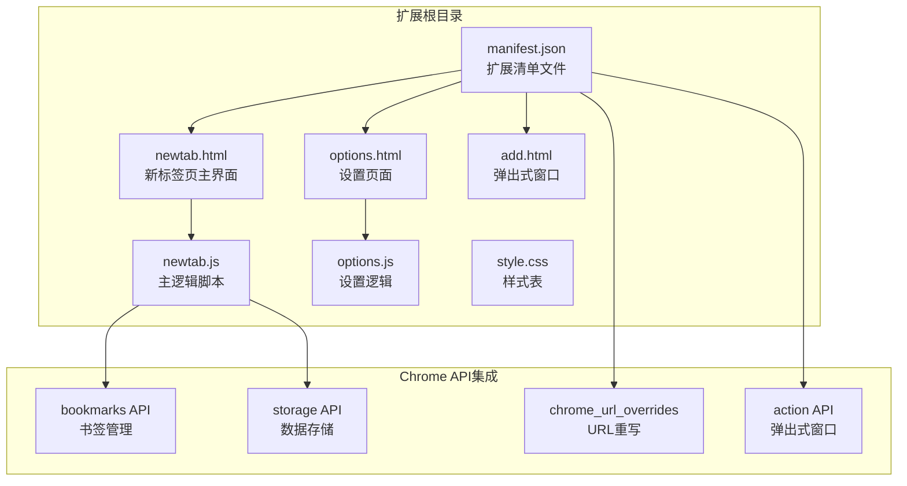
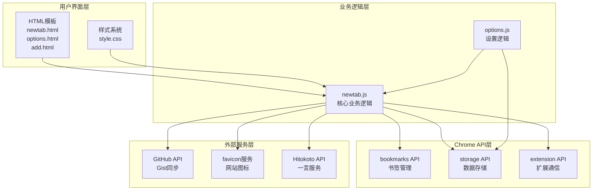
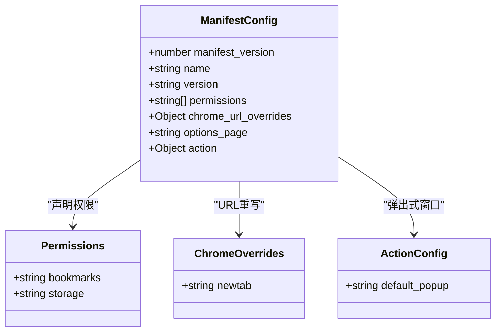
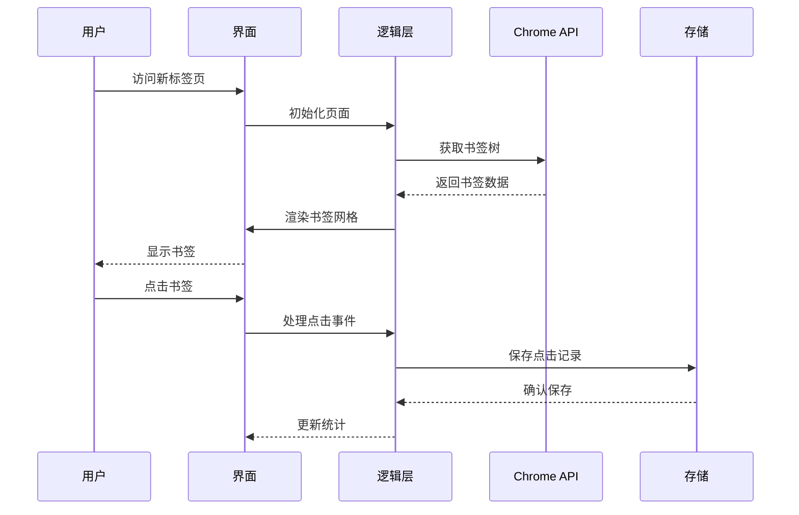
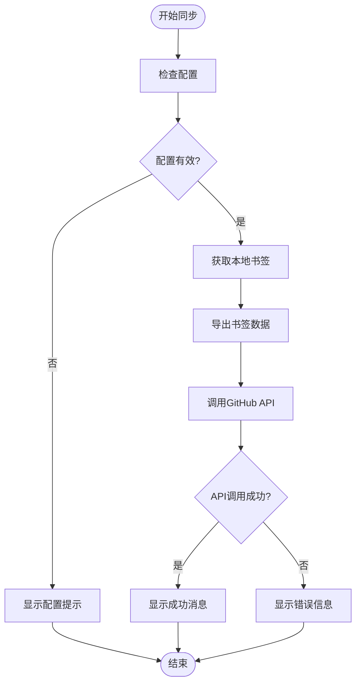
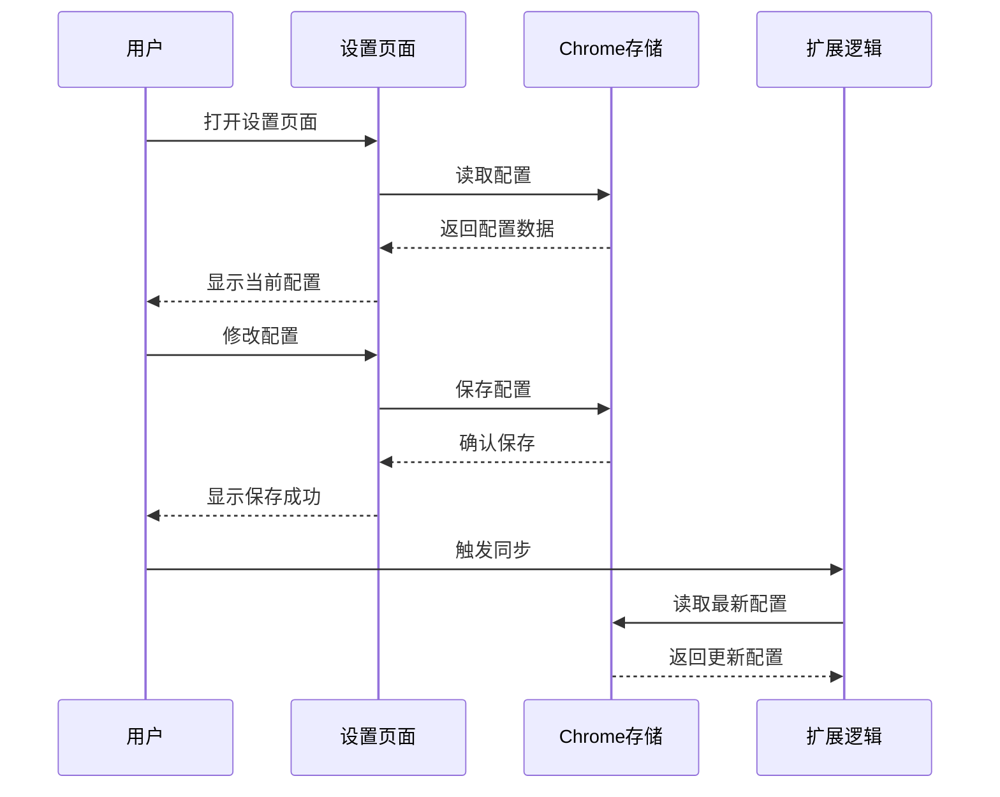
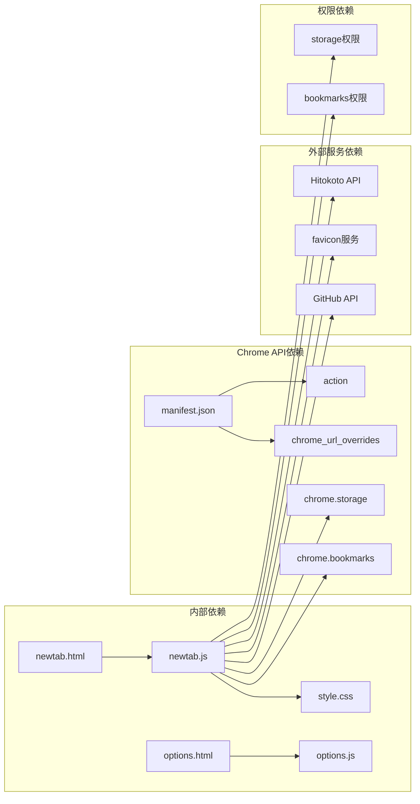
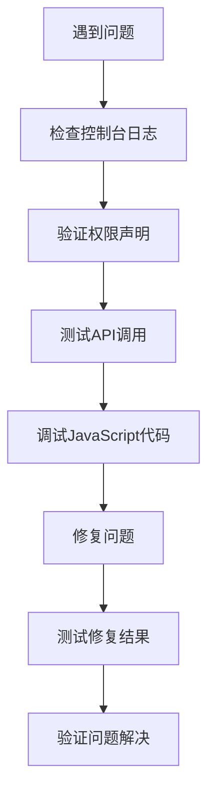
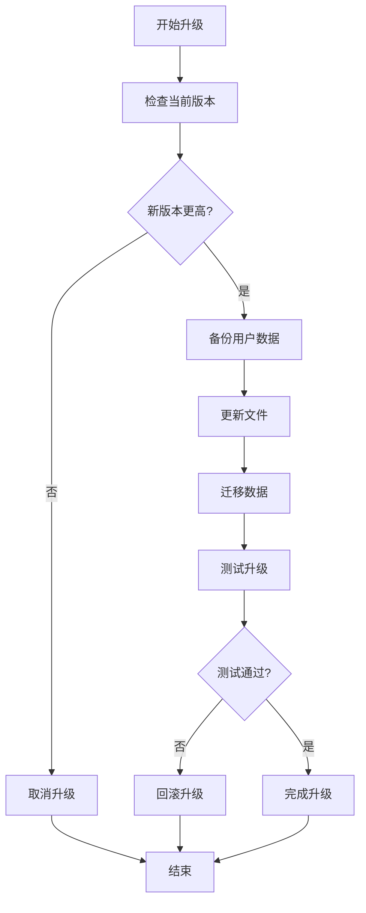

# 开发者指南

<cite>
**本文档引用的文件**
- [manifest.json](file://manifest.json)
- [newtab.html](file://newtab.html)
- [newtab.js](file://newtab.js)
- [options.html](file://options.html)
- [options.js](file://options.js)
- [add.html](file://add.html)
- [style.css](file://style.css)
</cite>

## 目录
1. [简介](#简介)
2. [项目结构](#项目结构)
3. [核心组件](#核心组件)
4. [架构概览](#架构概览)
5. [详细组件分析](#详细组件分析)
6. [依赖关系分析](#依赖关系分析)
7. [性能考虑](#性能考虑)
8. [调试指南](#调试指南)
9. [安全最佳实践](#安全最佳实践)
10. [二次开发指导](#二次开发指导)
11. [版本升级策略](#版本升级策略)
12. [发布流程](#发布流程)
13. [故障排除指南](#故障排除指南)
14. [结论](#结论)

## 简介

MyTab是一个基于Chrome Extension Manifest V3标准开发的书签管理扩展程序。该扩展提供了现代化的新标签页界面，集成了GitHub Gist同步功能，支持自定义搜索引擎配置，并具备美观的视觉设计。项目采用模块化架构设计，充分利用了Chrome浏览器提供的强大API生态系统。

## 项目结构

MyTab扩展采用简洁而高效的文件组织结构，主要包含以下核心文件：



**图表来源**
- [manifest.json](file://manifest.json#L1-L13)
- [newtab.html](file://newtab.html#L1-L64)
- [options.html](file://options.html#L1-L77)

**章节来源**
- [manifest.json](file://manifest.json#L1-L13)
- [newtab.html](file://newtab.html#L1-L64)
- [options.html](file://options.html#L1-L77)

## 核心组件

MyTab扩展由多个相互协作的核心组件构成，每个组件都有明确的职责分工：

### 扩展清单组件
- **manifest.json**: 定义扩展的基本信息、权限声明和入口点配置
- **权限管理**: 声明bookmarks和storage权限，确保扩展能够访问书签和本地存储

### 用户界面组件
- **newtab.html**: 新标签页主界面，包含导航栏、搜索区域和书签网格
- **options.html**: 设置页面，提供GitHub同步配置界面
- **add.html**: 弹出式窗口，作为扩展的交互入口

### 逻辑处理组件
- **newtab.js**: 核心业务逻辑，包括书签渲染、搜索引擎管理和GitHub同步
- **options.js**: 设置页面逻辑，负责配置数据的保存和读取

### 样式设计组件
- **style.css**: 提供现代化的视觉设计，包括毛玻璃效果和响应式布局

**章节来源**
- [manifest.json](file://manifest.json#L1-L13)
- [newtab.js](file://newtab.js#L1-L302)
- [options.js](file://options.js#L1-L29)

## 架构概览

MyTab扩展采用了分层架构设计，确保了良好的可维护性和扩展性：



**图表来源**
- [newtab.js](file://newtab.js#L1-L302)
- [options.js](file://options.js#L1-L29)
- [manifest.json](file://manifest.json#L1-L13)

## 详细组件分析

### 清单文件分析

manifest.json定义了扩展的基础配置和权限声明：



**图表来源**
- [manifest.json](file://manifest.json#L1-L13)

**章节来源**
- [manifest.json](file://manifest.json#L1-L13)

### 新标签页界面组件

newtab.html提供了完整的用户界面结构，包含多个功能区域：

#### 导航系统
- **侧边栏导航**: 包含主页、工作、社交等分类导航
- **设置入口**: 提供快速访问设置页面的功能

#### 搜索引擎管理
- **多引擎支持**: 内置必应、Google、百度三种搜索引擎
- **自定义引擎**: 支持用户添加和删除搜索引擎
- **引擎切换**: 通过下拉菜单实现引擎切换功能

#### 书签展示系统
- **网格布局**: 以图标形式展示常用书签
- **动态生成**: 基于书签树动态生成书签网格
- **图标获取**: 自动从favicon服务获取网站图标

**章节来源**
- [newtab.html](file://newtab.html#L1-L64)

### 核心逻辑组件

newtab.js实现了扩展的主要业务逻辑，采用模块化设计：

#### 书签管理模块


**图表来源**
- [newtab.js](file://newtab.js#L130-L150)

#### GitHub同步模块


**图表来源**
- [newtab.js](file://newtab.js#L43-L76)

**章节来源**
- [newtab.js](file://newtab.js#L1-L302)

### 设置页面组件

options.html和options.js提供了完整的配置管理功能：

#### 配置数据流


**图表来源**
- [options.js](file://options.js#L1-L29)

**章节来源**
- [options.html](file://options.html#L1-L77)
- [options.js](file://options.js#L1-L29)

### 样式设计组件

style.css实现了现代化的视觉设计，采用CSS变量和现代布局技术：

#### 设计特性
- **毛玻璃效果**: 使用backdrop-filter实现半透明背景
- **响应式布局**: 支持不同屏幕尺寸的自适应显示
- **动画过渡**: 提供流畅的交互体验
- **主题色彩**: 基于CSS变量的颜色管理系统

**章节来源**
- [style.css](file://style.css#L1-L199)

## 依赖关系分析

MyTab扩展的依赖关系相对简单但功能完整：



**图表来源**
- [manifest.json](file://manifest.json#L1-L13)
- [newtab.js](file://newtab.js#L1-L302)

**章节来源**
- [manifest.json](file://manifest.json#L1-L13)
- [newtab.js](file://newtab.js#L1-L302)

## 性能考虑

### 代码优化策略

1. **异步编程优化**
   - 使用Promise和async/await减少回调地狱
   - 合理使用缓存避免重复的API调用
   - 实现防抖和节流机制优化高频操作

2. **内存管理**
   - 及时清理DOM事件监听器
   - 避免内存泄漏的闭包引用
   - 合理使用WeakMap等弱引用结构

3. **网络请求优化**
   - 实现请求缓存机制
   - 使用HTTP缓存头优化静态资源
   - 合并小文件减少HTTP请求次数

### 性能监控建议

- 实现关键路径性能监控
- 监控扩展启动时间和内存使用
- 分析用户交互延迟和响应时间

## 调试指南

### 开发环境设置

1. **Chrome扩展调试**
   - 启用开发者模式
   - 加载未打包的扩展
   - 使用开发者工具检查控制台输出

2. **常见问题诊断**
   - 检查权限是否正确声明
   - 验证API调用是否符合Chrome规范
   - 确认跨域请求是否被允许

### 调试技巧



**章节来源**
- [newtab.js](file://newtab.js#L1-L302)

## 安全最佳实践

### 权限最小化原则
- 仅声明必要的权限
- 定期审查权限使用情况
- 避免过度收集用户数据

### 数据保护措施
- 对敏感数据进行加密存储
- 实施适当的访问控制
- 定期清理临时数据

### 网络安全
- 验证所有外部API响应
- 实施CORS策略
- 使用HTTPS协议通信

## 二次开发指导

### 扩展功能开发

#### 新增书签分类功能
1. 在HTML中添加新的导航项
2. 在JavaScript中实现对应的处理逻辑
3. 更新CSS样式以支持新布局

#### 添加新的搜索引擎
1. 在用户引擎数组中添加新引擎配置
2. 实现引擎切换逻辑
3. 更新UI以显示新引擎

#### 集成新的外部服务
1. 在manifest.json中声明必要的权限
2. 实现API调用逻辑
3. 添加相应的用户界面元素

### API扩展方法

#### 自定义Chrome API集成
```javascript
// 示例：添加新的Chrome API调用
async function customApiCall(data) {
    try {
        const response = await chrome.runtime.sendMessage({
            action: "customAction",
            payload: data
        });
        return response;
    } catch (error) {
        console.error("API调用失败:", error);
        throw error;
    }
}
```

#### 数据持久化扩展
```javascript
// 示例：扩展存储功能
class DataManager {
    constructor() {
        this.storage = chrome.storage.sync;
    }
    
    async set(key, value) {
        return new Promise((resolve) => {
            this.storage.set({ [key]: value }, resolve);
        });
    }
    
    async get(key) {
        return new Promise((resolve) => {
            this.storage.get([key], (result) => resolve(result[key]));
        });
    }
}
```

### 自定义组件开发

#### 创建可复用的UI组件
```javascript
// 示例：通用的弹窗组件
class ModalComponent {
    constructor(elementId) {
        this.element = document.getElementById(elementId);
        this.initEventListeners();
    }
    
    initEventListeners() {
        const closeBtn = this.element.querySelector('.close-btn');
        closeBtn.addEventListener('click', () => this.close());
        
        this.element.addEventListener('click', (e) => {
            if (e.target === this.element) {
                this.close();
            }
        });
    }
    
    open() {
        this.element.classList.add('active');
    }
    
    close() {
        this.element.classList.remove('active');
    }
}
```

## 版本升级策略

### 向后兼容性处理

1. **API兼容性**
   - 保持对旧版Chrome API的支持
   - 实现渐进式增强策略
   - 提供降级方案

2. **数据格式兼容**
   - 版本化存储的数据格式
   - 实现数据迁移脚本
   - 保持配置文件的向后兼容

### 升级流程



## 发布流程

### 开发阶段
1. **功能测试**: 确保所有功能正常工作
2. **性能测试**: 验证扩展的性能表现
3. **兼容性测试**: 测试不同版本Chrome的兼容性

### 构建准备
1. **代码压缩**: 压缩JavaScript和CSS文件
2. **资源优化**: 优化图片和静态资源
3. **清单验证**: 检查manifest.json的正确性

### 发布步骤
1. **打包扩展**: 创建.crx文件
2. **签名证书**: 为扩展申请数字证书
3. **提交审核**: 在Chrome Web Store提交审核
4. **发布上线**: 审核通过后正式发布

## 故障排除指南

### 常见问题及解决方案

#### 权限相关问题
- **问题**: 书签无法读取
- **原因**: 缺少bookmarks权限
- **解决**: 在manifest.json中添加bookmarks权限

#### API调用失败
- **问题**: GitHub同步失败
- **原因**: Token无效或网络问题
- **解决**: 检查Token配置和网络连接

#### 页面加载异常
- **问题**: 新标签页显示空白
- **原因**: JavaScript执行错误
- **解决**: 检查控制台错误信息

### 调试工具使用

1. **Chrome开发者工具**
   - 使用Elements面板检查DOM结构
   - 使用Console面板查看错误信息
   - 使用Network面板监控网络请求

2. **扩展专用工具**
   - 打开扩展页面查看详细信息
   - 使用扩展的调试功能
   - 检查扩展的后台日志

**章节来源**
- [newtab.js](file://newtab.js#L1-L302)
- [options.js](file://options.js#L1-L29)

## 结论

MyTab扩展展示了如何利用Chrome Extension Manifest V3标准构建功能丰富且用户体验优秀的浏览器扩展。通过合理的架构设计、清晰的模块划分和完善的错误处理机制，该项目为开发者提供了一个优秀的参考范例。

在二次开发过程中，开发者可以基于现有的架构基础，按照本文档提供的指导原则和最佳实践，安全地扩展功能、优化性能并确保向后兼容性。同时，遵循安全最佳实践和发布流程，可以确保扩展的质量和用户的使用体验。