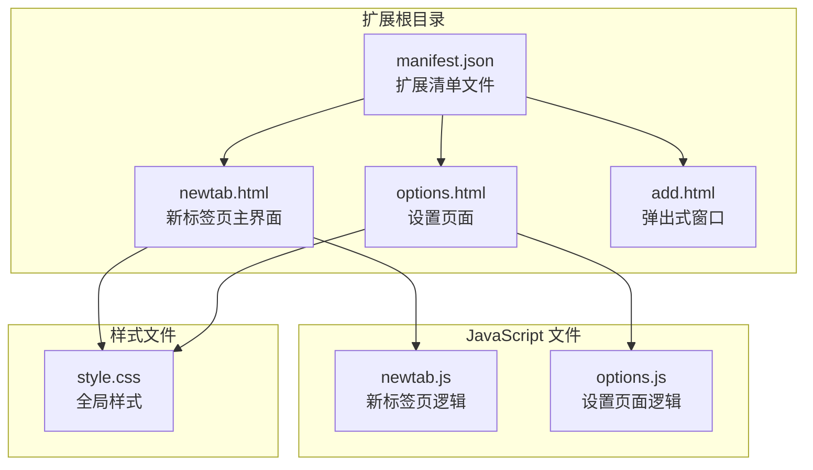
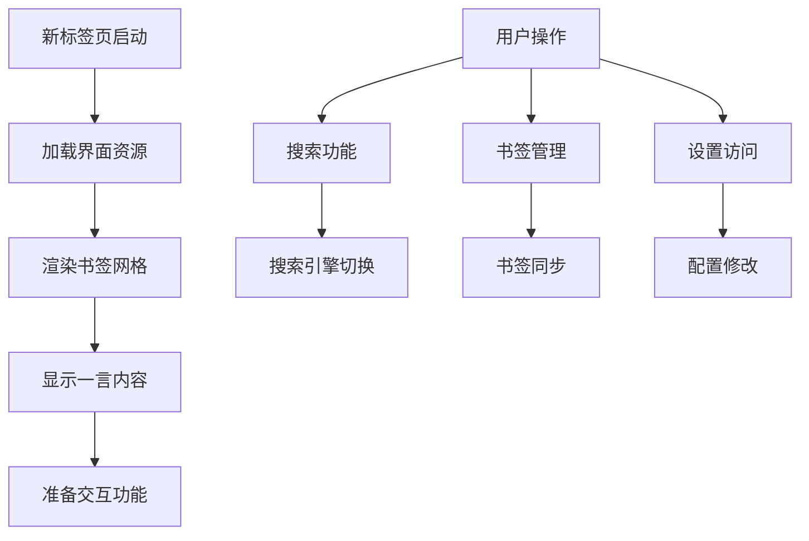
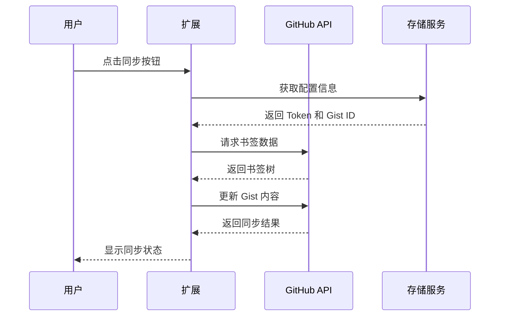
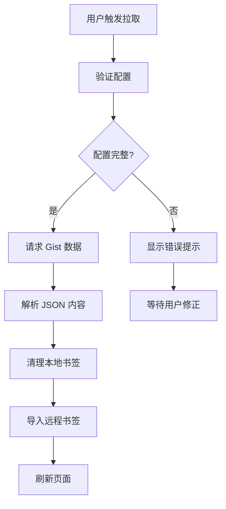
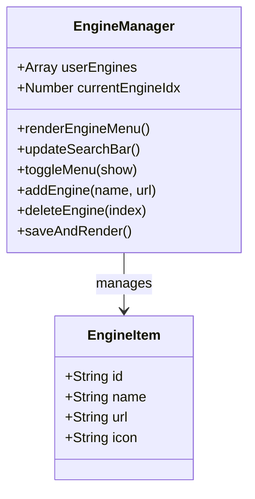

# 快速开始

<cite>
**本文档引用的文件**
- [manifest.json](file://manifest.json)
- [newtab.html](file://newtab.html)
- [newtab.js](file://newtab.js)
- [options.html](file://options.html)
- [options.js](file://options.js)
- [style.css](file://style.css)
- [add.html](file://add.html)
</cite>

## 目录
1. [简介](#简介)
2. [项目结构](#项目结构)
3. [安装与加载](#安装与加载)
4. [首次配置](#首次配置)
5. [核心功能使用](#核心功能使用)
6. [GitHub 同步配置](#github-同步配置)
7. [书签管理](#书签管理)
8. [搜索引擎配置](#搜索引擎配置)
9. [常见问题解决](#常见问题解决)
10. [故障排除指南](#故障排除指南)
11. [最佳实践](#最佳实践)
12. [总结](#总结)

## 简介

MyTab 是一个基于 Chrome 扩展的现代化新标签页应用，集成了书签管理、GitHub 同步、个性化搜索引擎等功能。该扩展通过 Chrome Manifest V3 构建，提供了简洁美观的界面和强大的书签管理能力。

主要特性：
- 基于 Google Chrome 书签系统的可视化展示
- GitHub Gist 同步备份书签
- 自定义搜索引擎配置
- 现代化毛玻璃界面设计
- 一言每日一句功能

## 项目结构

MyTab 扩展采用模块化架构设计，核心文件组织如下：

**图表来源**
- [manifest.json](file://manifest.json#L1-L13)
- [newtab.html](file://newtab.html#L1-L64)
- [options.html](file://options.html#L1-L77)

**章节来源**
- [manifest.json](file://manifest.json#L1-L13)
- [newtab.html](file://newtab.html#L1-L64)
- [options.html](file://options.html#L1-L77)

## 安装与加载

### 方法一：从 Chrome Web Store 安装（推荐）

1. 打开 Chrome 浏览器
2. 访问 Chrome Web Store
3. 搜索 "GitHub Bookmark Tab"
4. 点击安装按钮
5. 确认权限授权
6. 安装完成后重启浏览器

### 方法二：手动加载未打包扩展

1. **下载源码**
   - 克隆仓库或下载 ZIP 包
   - 解压到任意目录

2. **启用开发者模式**
   - 打开 Chrome 设置
   - 点击左侧菜单"扩展程序"
   - 开启"开发者模式"开关

3. **加载扩展**
   - 点击"加载已解压的扩展程序"
   - 选择项目根目录
   - 确认加载成功

4. **验证安装**
   - 打开新标签页
   - 应该看到 MyTab 的界面
   - 检查扩展图标是否正常显示

**章节来源**
- [manifest.json](file://manifest.json#L1-L13)
- [newtab.html](file://newtab.html#L1-L64)

## 首次配置

### 1. 访问设置页面

1. 点击浏览器右上角的扩展图标
2. 选择"选项"或"设置"链接
3. 进入 GitHub 同步设置页面

### 2. 基本界面介绍

设置页面包含以下元素：
- **标题区域**：显示 "GitHub 同步设置"
- **Token 输入框**：用于输入 GitHub Personal Access Token
- **Gist ID 输入框**：用于输入目标 Gist 的 ID
- **保存按钮**：保存配置信息
- **状态提示区**：显示保存结果

### 3. 配置要求

- **Token 类型**：必须是 Personal Access Token (PAT)
- **权限要求**：至少需要 `gist` 权限
- **Gist ID**：目标 Gist 的唯一标识符

**章节来源**
- [options.html](file://options.html#L1-L77)
- [options.js](file://options.js#L1-L29)

## 核心功能使用

### 新标签页界面概览

**图表来源**
- [newtab.html](file://newtab.html#L10-L64)
- [newtab.js](file://newtab.js#L213-L218)

### 主要界面元素

1. **侧边栏导航**
   - 🏠 默认分类
   - 💻 工作分类  
   - 💬 社交分类
   - ⚙️ 设置入口

2. **搜索区域**
   - 引擎选择下拉菜单
   - 搜索输入框
   - 搜索提交按钮

3. **书签展示区**
   - 图标化书签网格
   - 点击即可访问

4. **每日一句**
   - 点击可刷新内容

**章节来源**
- [newtab.html](file://newtab.html#L14-L58)
- [style.css](file://style.css#L24-L46)

## GitHub 同步配置

### 1. 创建 GitHub Personal Access Token

1. 登录 GitHub 账户
2. 点击头像 → Settings
3. 左侧菜单选择 Developer settings
4. 选择 Personal access tokens → Tokens(classic)
5. 点击 Generate new token
6. 勾选 `gist` 权限
7. 生成并复制 Token

### 2. 准备 Gist

1. 访问 https://gist.github.com
2. 创建新的 Gist
3. 添加一个名为 `bookmarks.json` 的文件
4. 复制 Gist 的 ID 部分

### 3. 配置扩展

在设置页面中：
- 将 Token 粘贴到第一个输入框
- 将 Gist ID 粘贴到第二个输入框
- 点击保存按钮

**章节来源**
- [options.html](file://options.html#L64-L71)
- [options.js](file://options.js#L10-L27)

## 书签管理

### 查看本地书签

1. 打开新标签页
2. 界面会自动加载并显示书签
3. 书签以图标形式展示在网格中
4. 点击书签图标即可访问

### 同步到 GitHub

**图表来源**
- [newtab.js](file://newtab.js#L43-L76)

### 从 GitHub 拉取书签

**图表来源**
- [newtab.js](file://newtab.js#L78-L94)

**章节来源**
- [newtab.js](file://newtab.js#L2-L24)
- [newtab.js](file://newtab.js#L43-L76)
- [newtab.js](file://newtab.js#L78-L94)

## 搜索引擎配置

### 默认搜索引擎

扩展内置了三个主流搜索引擎：
- 必应 (Bing)
- Google
- 百度

### 自定义搜索引擎

**图表来源**
- [newtab.js](file://newtab.js#L223-L302)

### 操作步骤

1. **打开引擎菜单**
   - 点击搜索框右侧的下拉箭头
   - 或点击搜索图标

2. **切换搜索引擎**
   - 点击目标引擎图标
   - 引擎图标会更新为当前选择

3. **添加自定义引擎**
   - 点击"添加"按钮
   - 输入引擎名称
   - 输入搜索 URL（使用 `%s` 作为占位符）
   - 点击确定

4. **删除不需要的引擎**
   - 在引擎列表中悬停
   - 点击红色删除按钮 ×

**章节来源**
- [newtab.js](file://newtab.js#L231-L294)
- [newtab.js](file://newtab.js#L296-L302)

## 常见问题解决

### 1. 扩展无法加载

**问题症状**：加载扩展时报错或显示空白

**解决方案**：
1. 确认已开启开发者模式
2. 检查 manifest.json 是否存在语法错误
3. 清理浏览器缓存后重试
4. 尝试重新安装扩展

### 2. GitHub 同步失败

**问题症状**：同步时出现错误提示

**可能原因及解决**：
- **Token 无效**：重新生成并配置
- **权限不足**：确保 Token 包含 `gist` 权限
- **网络连接问题**：检查网络状态
- **Gist ID 错误**：确认 Gist ID 正确无误

### 3. 书签不显示

**问题症状**：新标签页空白或只显示部分书签

**解决方案**：
1. 检查 Chrome 书签权限
2. 确认书签数量合理（避免过多导致性能问题）
3. 刷新页面重新加载
4. 检查浏览器书签是否被其他扩展影响

### 4. 搜索引擎无法切换

**问题症状**：点击引擎图标无响应

**解决方案**：
1. 检查 JavaScript 是否正确加载
2. 清除浏览器缓存
3. 重新安装扩展
4. 检查是否有其他扩展冲突

**章节来源**
- [newtab.js](file://newtab.js#L45-L48)
- [newtab.js](file://newtab.js#L72-L75)

## 故障排除指南

### 调试工具使用

1. **打开开发者工具**
   - 右键页面 → 检查元素
   - 或按 F12 打开

2. **查看控制台日志**
   - 检查是否有 JavaScript 错误
   - 关注网络请求状态

3. **检查扩展页面**
   - 访问 chrome://extensions/
   - 查看扩展状态和权限

### 常见错误代码

| 错误类型 | 可能原因 | 解决方案 |
|---------|---------|---------|
| 401 Unauthorized | Token 无效或过期 | 重新生成并配置 Token |
| 403 Forbidden | 权限不足 | 确保 Token 包含 gist 权限 |
| 404 Not Found | Gist ID 错误 | 检查并修正 Gist ID |
| Network Error | 网络连接问题 | 检查网络状态 |

### 性能优化建议

1. **减少书签数量**：过多书签会影响加载速度
2. **定期清理无效书签**：保持书签结构清晰
3. **使用合适的搜索引擎**：选择响应速度快的引擎
4. **避免同时运行多个同类扩展**

**章节来源**
- [newtab.js](file://newtab.js#L108-L126)

## 最佳实践

### 1. 安全配置

- **Token 管理**：定期轮换 Personal Access Token
- **权限最小化**：仅授予必要的 gist 权限
- **存储安全**：不要在公共场合分享 Token

### 2. 数据备份

- **定期同步**：建议每天同步一次书签
- **多设备同步**：在不同设备上配置相同的 Gist
- **版本控制**：利用 GitHub 的版本历史功能

### 3. 使用技巧

- **快捷键**：使用 Ctrl+T 打开新标签页
- **书签分类**：合理组织书签文件夹结构
- **搜索引擎**：根据使用习惯定制搜索引擎

### 4. 维护建议

- **定期更新**：关注扩展更新通知
- **清理缓存**：定期清理浏览器缓存
- **监控状态**：定期检查同步状态

## 总结

MyTab Chrome 扩展为用户提供了便捷的书签管理和跨设备同步功能。通过简单的配置，用户可以实现：

- **无缝的书签管理体验**
- **可靠的云端备份机制**  
- **个性化的搜索体验**
- **现代化的界面设计**

### 下一步行动

1. 完成 GitHub 同步配置
2. 导入现有书签
3. 自定义搜索引擎
4. 探索更多高级功能

如遇任何问题，请参考故障排除指南或联系技术支持。祝您使用愉快！