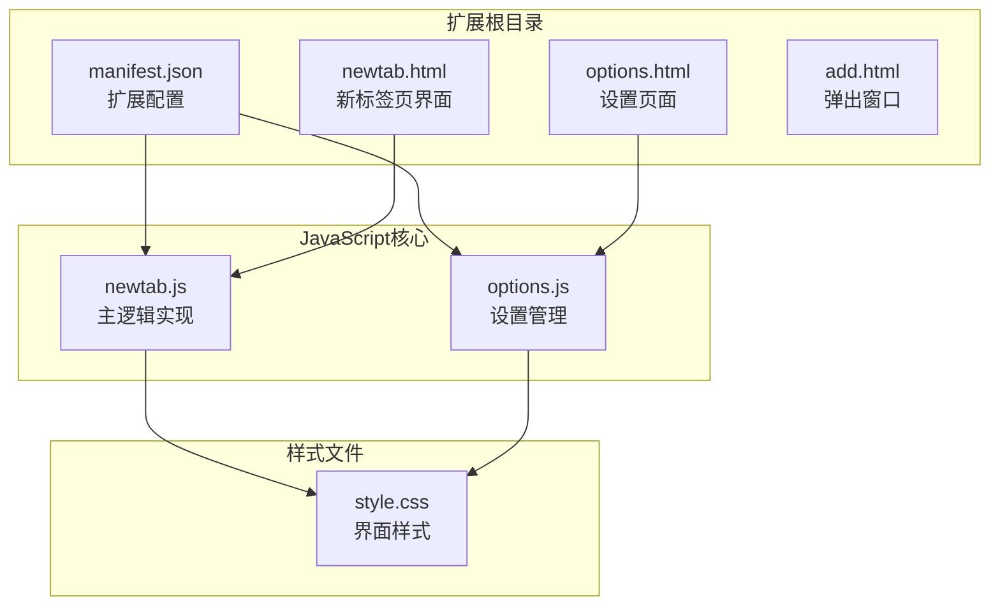
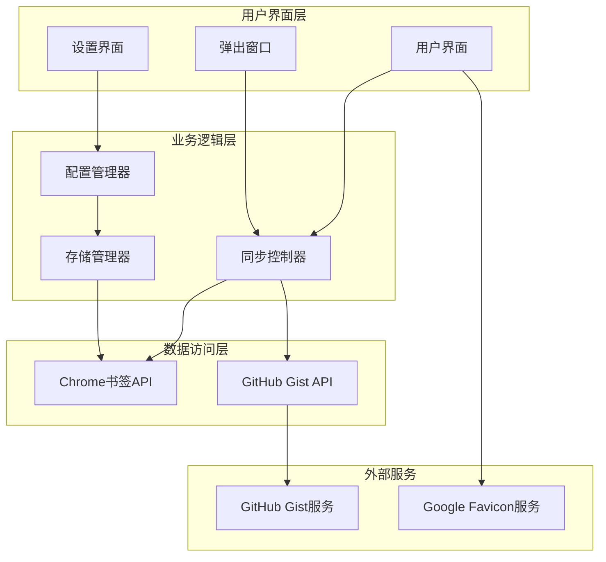
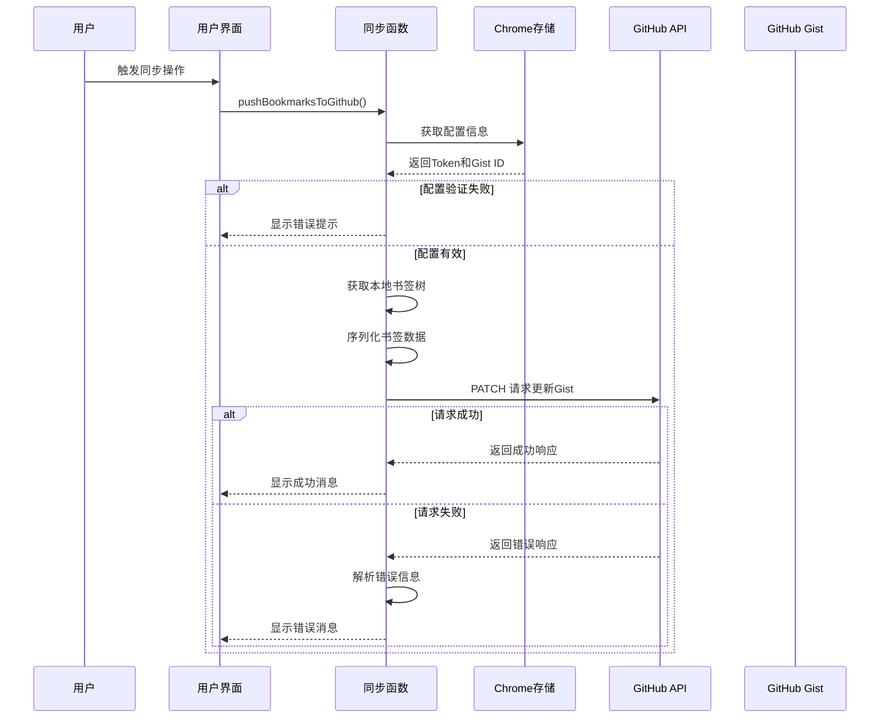
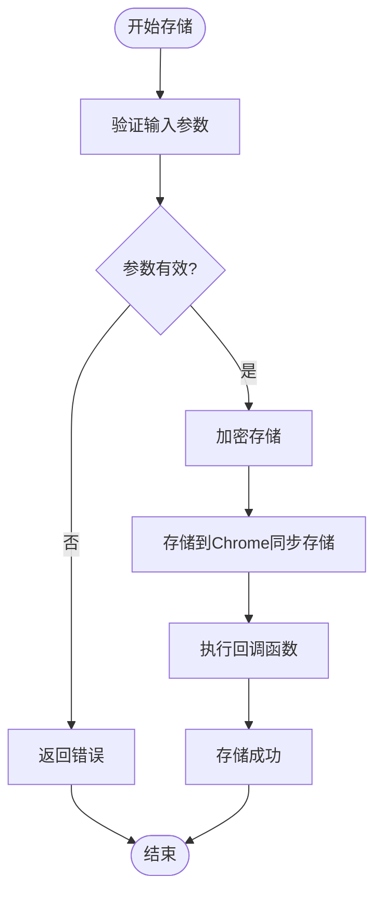
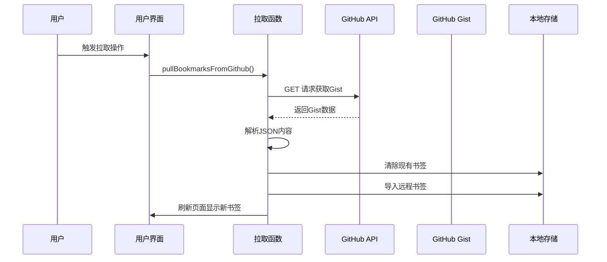
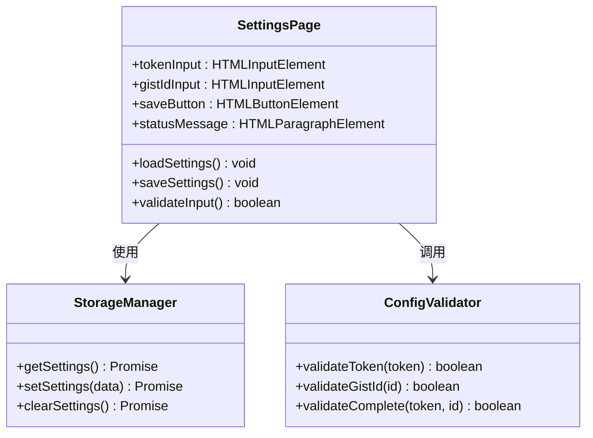
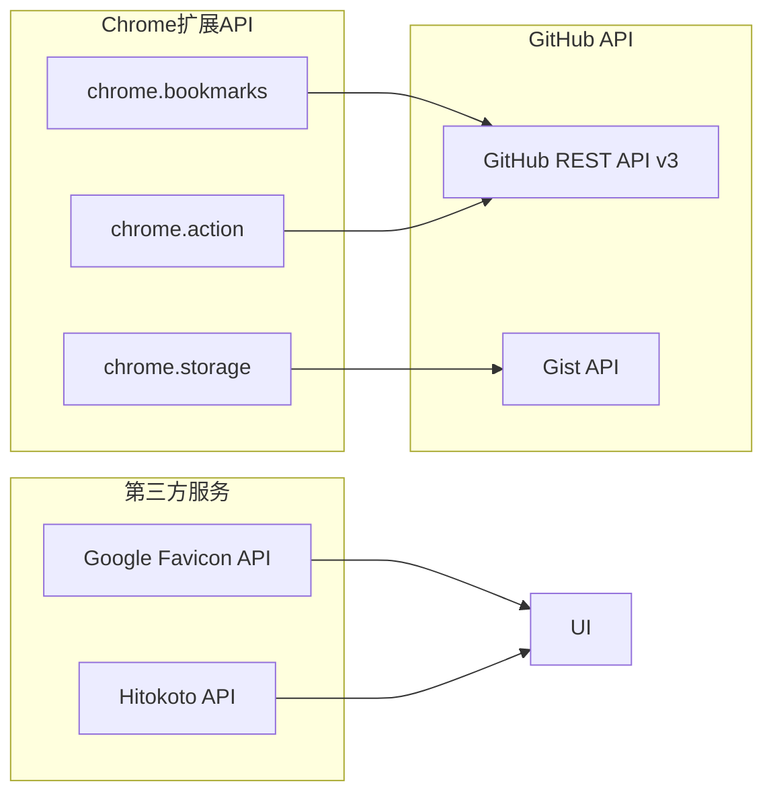
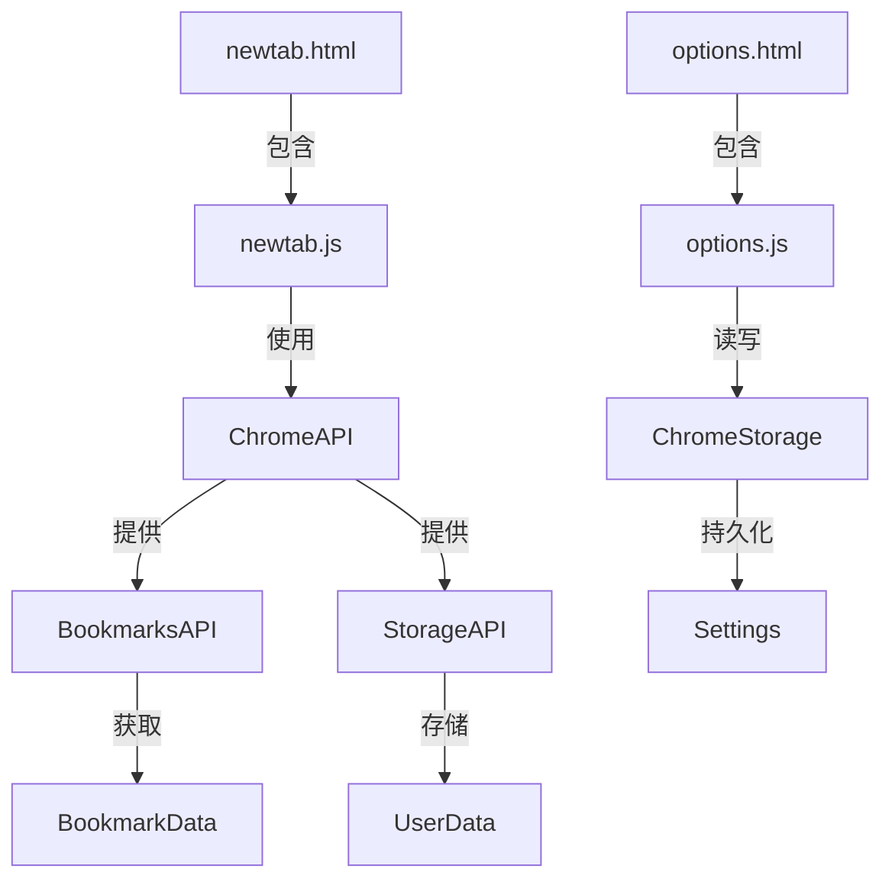
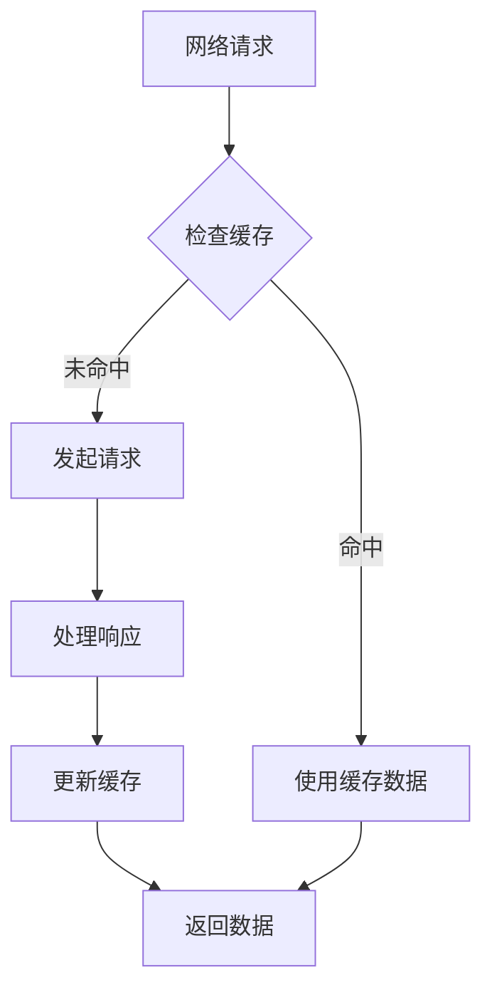

# GitHub同步功能

<cite>
**本文档引用的文件**
- [manifest.json](file://manifest.json)
- [newtab.js](file://newtab.js)
- [options.js](file://options.js)
- [options.html](file://options.html)
- [newtab.html](file://newtab.html)
- [style.css](file://style.css)
</cite>

## 目录
1. [简介](#简介)
2. [项目结构](#项目结构)
3. [核心组件](#核心组件)
4. [架构概览](#架构概览)
5. [详细组件分析](#详细组件分析)
6. [依赖关系分析](#依赖关系分析)
7. [性能考虑](#性能考虑)
8. [故障排除指南](#故障排除指南)
9. [结论](#结论)

## 简介

MyTab扩展的GitHub同步功能是一个Chrome浏览器扩展，允许用户将浏览器书签与GitHub Gist进行双向同步。该功能通过GitHub Personal Access Token (PAT)进行身份验证，使用Chrome扩展API访问书签数据，并通过GitHub API与远程Gist进行数据交换。

该系统提供了完整的书签备份和恢复机制，支持跨设备同步书签数据，同时确保用户数据的安全性和隐私性。

## 项目结构

MyTab扩展采用模块化的文件组织结构，主要包含以下核心文件：

**图表来源**
- [manifest.json](file://manifest.json#L1-L13)
- [newtab.js](file://newtab.js#L1-L302)
- [options.js](file://options.js#L1-L29)

**章节来源**
- [manifest.json](file://manifest.json#L1-L13)
- [newtab.js](file://newtab.js#L1-L302)
- [options.js](file://options.js#L1-L29)

## 核心组件

### 扩展权限配置

扩展通过manifest.json声明了必要的权限：
- **bookmarks**: 访问和操作浏览器书签
- **storage**: 存储用户配置和敏感数据
- **chrome_url_overrides**: 自定义新标签页行为

### 主要功能模块

1. **书签同步模块**: 负责书签数据的获取、序列化和传输
2. **GitHub API模块**: 处理与GitHub Gist的交互
3. **配置管理模块**: 管理用户设置和安全令牌
4. **UI交互模块**: 提供用户界面和反馈机制

**章节来源**
- [manifest.json](file://manifest.json#L5-L12)
- [newtab.js](file://newtab.js#L26-L42)

## 架构概览

系统采用分层架构设计，实现了清晰的关注点分离：

**图表来源**
- [newtab.js](file://newtab.js#L43-L94)
- [options.js](file://options.js#L1-L29)
- [manifest.json](file://manifest.json#L5-L12)

## 详细组件分析

### pushBookmarksToGithub() 函数实现

该函数是同步功能的核心实现，负责将本地书签数据推送到GitHub Gist：

**图表来源**
- [newtab.js](file://newtab.js#L43-L76)

#### 数据序列化过程

书签数据的序列化采用以下步骤：

1. **数据获取**: 使用`chrome.bookmarks.getTree()`获取完整的书签树结构
2. **格式转换**: 将书签对象转换为JSON格式字符串
3. **内容封装**: 将JSON数据封装到Gist文件结构中
4. **API传输**: 通过PATCH请求发送到GitHub API

#### 安全存储机制

配置信息通过Chrome的`chrome.storage.sync` API进行安全存储：

**图表来源**
- [newtab.js](file://newtab.js#L26-L33)
- [options.js](file://options.js#L19-L27)

**章节来源**
- [newtab.js](file://newtab.js#L43-L76)
- [newtab.js](file://newtab.js#L26-L42)

### pullBookmarksFromGithub() 函数实现

该函数负责从GitHub Gist拉取书签数据并应用到本地：

**图表来源**
- [newtab.js](file://newtab.js#L78-L94)

#### 冲突解决策略

当前实现采用直接覆盖策略，存在以下风险：

1. **数据丢失风险**: 远程更改可能覆盖本地未同步的书签
2. **无版本控制**: 缺乏版本历史记录和冲突检测机制
3. **批量操作**: 整体替换而非增量更新

**章节来源**
- [newtab.js](file://newtab.js#L78-L94)

### 配置管理系统

#### 设置页面实现

设置页面提供了用户友好的界面来管理GitHub同步配置：

**图表来源**
- [options.js](file://options.js#L1-L29)
- [options.html](file://options.html#L61-L77)

**章节来源**
- [options.js](file://options.js#L1-L29)
- [options.html](file://options.html#L61-L77)

## 依赖关系分析

### 外部依赖

系统依赖于以下外部服务和API：

**图表来源**
- [manifest.json](file://manifest.json#L5-L12)
- [newtab.js](file://newtab.js#L108-L126)

### 内部模块依赖

**图表来源**
- [newtab.js](file://newtab.js#L1-L302)
- [options.js](file://options.js#L1-L29)

**章节来源**
- [manifest.json](file://manifest.json#L5-L12)
- [newtab.js](file://newtab.js#L1-L302)

## 性能考虑

### 数据处理优化

1. **异步操作**: 所有网络请求和存储操作都采用Promise和async/await模式
2. **增量更新**: 建议实现差异比较算法，避免全量替换
3. **缓存策略**: 利用Chrome存储的本地缓存减少重复请求

### 网络请求优化

### 错误处理和重试机制

当前实现的错误处理相对简单，建议增强以下方面：

1. **指数退避重试**: 对临时性错误实施指数退避重试策略
2. **超时控制**: 为所有网络请求设置合理的超时时间
3. **错误分类**: 区分可重试错误和永久性错误

## 故障排除指南

### 常见问题及解决方案

#### 1. 认证失败

**症状**: 同步操作返回401或403错误
**原因**: Token无效或权限不足
**解决方案**:
- 重新生成具有`gist`权限的Personal Access Token
- 验证Token格式是否正确
- 检查GitHub账户状态

#### 2. Gist ID错误

**症状**: 同步操作返回404错误
**原因**: Gist ID不存在或已被删除
**解决方案**:
- 重新创建Gist并获取新的ID
- 验证Gist ID格式
- 检查Gist可见性设置

#### 3. 数据同步冲突

**症状**: 本地书签被意外覆盖
**原因**: 当前实现采用直接覆盖策略
**解决方案**:
- 实现冲突检测和合并机制
- 添加用户确认对话框
- 实施版本控制和历史记录

#### 4. 网络连接问题

**症状**: 同步操作超时或失败
**原因**: 网络不稳定或GitHub服务异常
**解决方案**:
- 实施重试机制和超时处理
- 添加离线模式支持
- 提供错误重试选项

### 调试技巧

1. **开发者工具**: 使用Chrome开发者工具监控网络请求
2. **日志记录**: 在关键节点添加详细的日志输出
3. **状态检查**: 实现同步状态的可视化指示器

**章节来源**
- [newtab.js](file://newtab.js#L69-L75)
- [newtab.js](file://newtab.js#L88-L94)

## 结论

MyTab扩展的GitHub同步功能提供了一个实用的书签备份和恢复解决方案。该系统通过简洁的实现和直观的用户界面，成功地将复杂的同步逻辑封装在易于使用的接口背后。

### 主要优势

1. **安全性**: 使用Chrome存储API安全地管理敏感的个人访问令牌
2. **易用性**: 提供简单的设置界面和直观的操作流程
3. **可靠性**: 基于成熟的GitHub Gist服务，确保数据持久性
4. **扩展性**: 模块化设计便于功能扩展和维护

### 改进建议

1. **增强冲突解决**: 实现智能的冲突检测和合并机制
2. **优化性能**: 引入增量同步和缓存策略
3. **提升用户体验**: 添加进度指示和错误恢复功能
4. **加强安全性**: 考虑使用更安全的存储方案和传输加密

该功能为用户提供了可靠的书签管理解决方案，是Chrome扩展生态系统中的一个优秀实践案例。