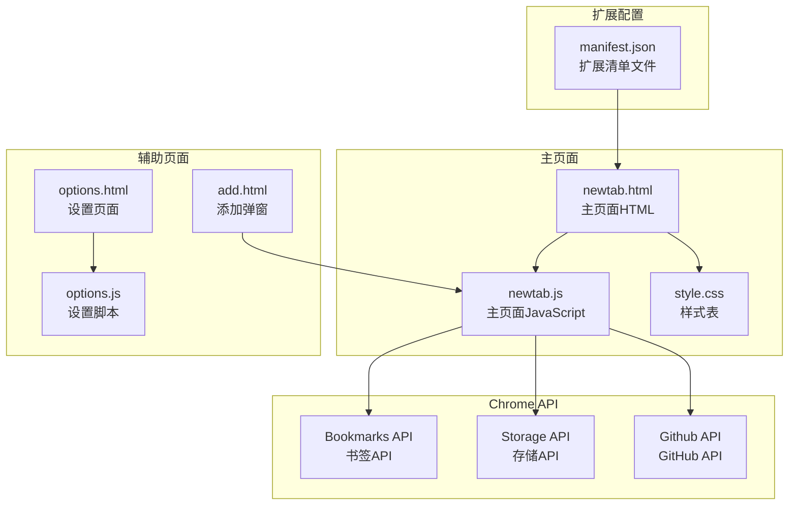
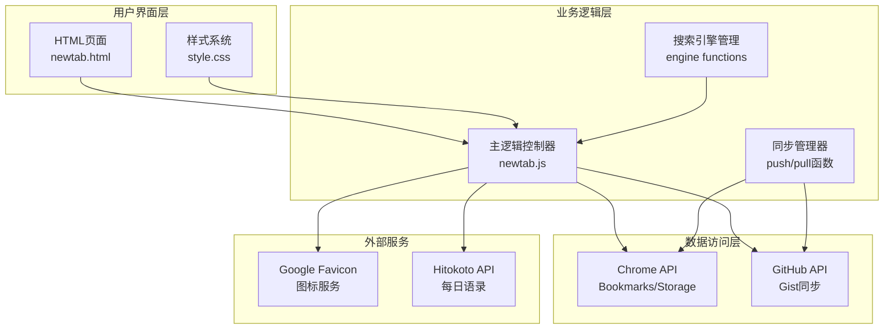
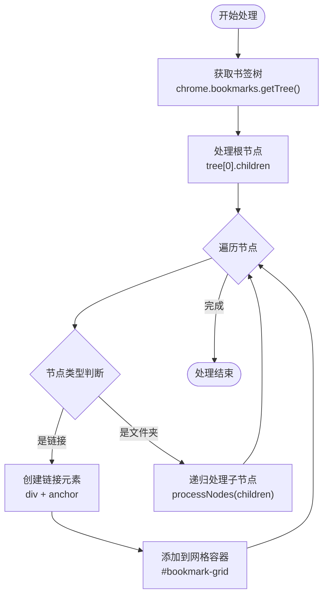
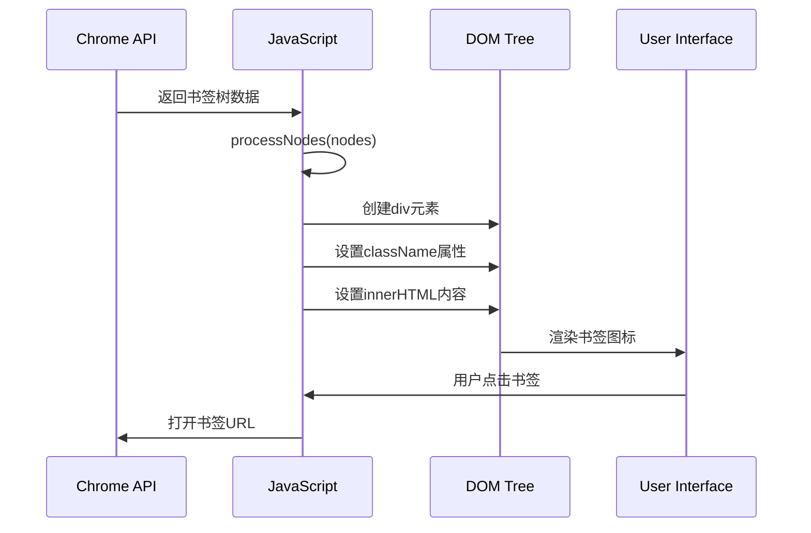
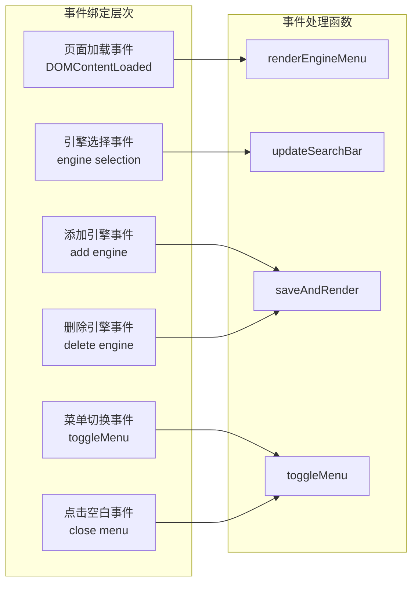
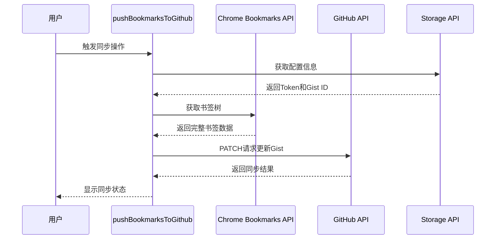
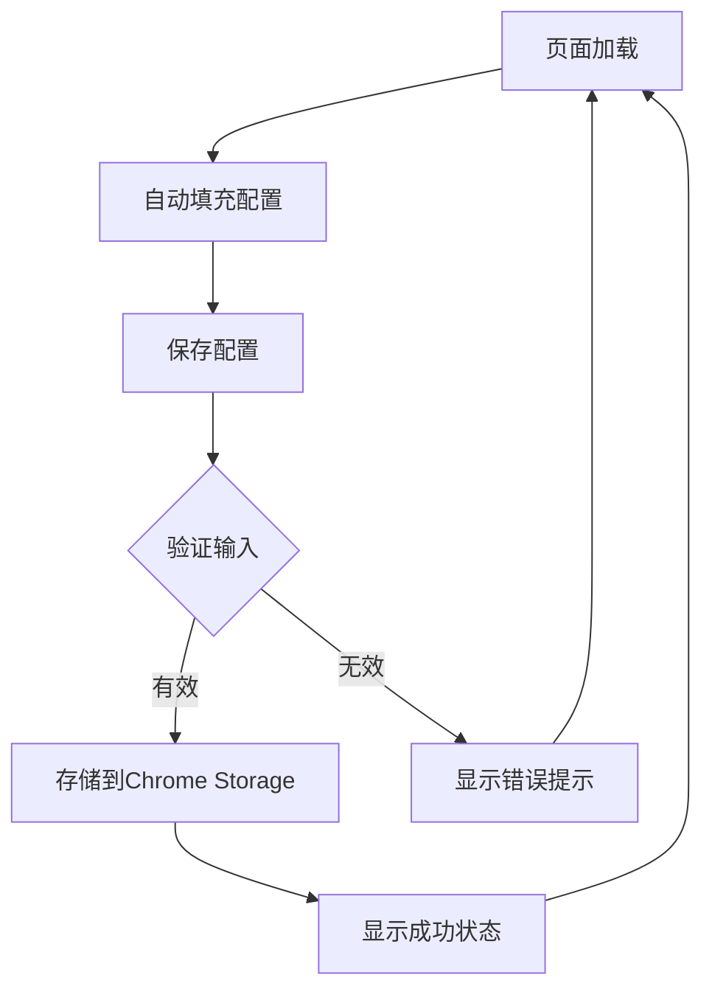
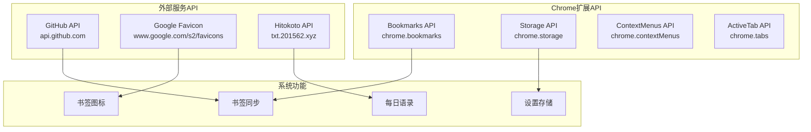
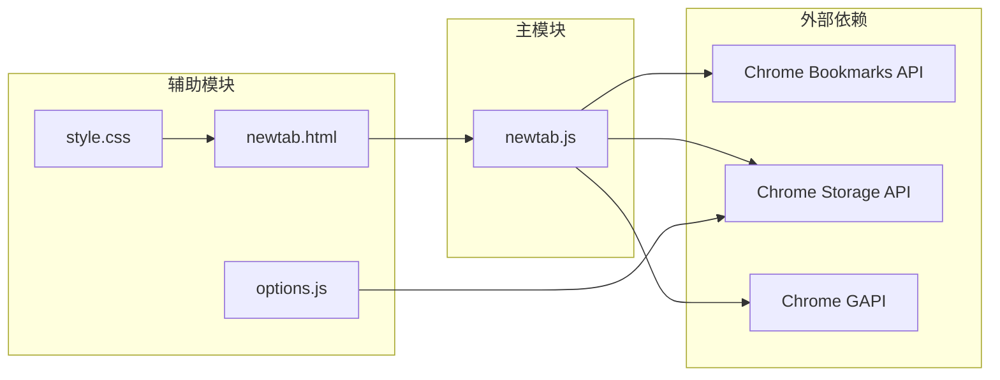

# 书签管理系统

<cite>
**本文档引用的文件**
- [manifest.json](file://manifest.json)
- [newtab.js](file://newtab.js)
- [newtab.html](file://newtab.html)
- [options.html](file://options.html)
- [options.js](file://options.js)
- [style.css](file://style.css)
- [add.html](file://add.html)
</cite>

## 目录
1. [简介](#简介)
2. [项目结构](#项目结构)
3. [核心组件](#核心组件)
4. [架构概览](#架构概览)
5. [详细组件分析](#详细组件分析)
6. [依赖关系分析](#依赖关系分析)
7. [性能考虑](#性能考虑)
8. [故障排除指南](#故障排除指南)
9. [结论](#结论)

## 简介

MyTab是一个基于Chrome扩展的书签管理系统，它提供了现代化的书签展示界面和与Chrome Bookmarks API的深度集成。该系统通过Google的favicon服务为书签提供图标，支持书签的云端备份和恢复功能，同时集成了个性化的一言（Hitokoto）每日语录功能。

该扩展的核心功能包括：
- 书签树形结构的递归处理和动态渲染
- 基于网格布局的书签图标展示
- 与Chrome Bookmarks API的双向同步
- GitHub Gist的云端备份和恢复
- 用户自定义搜索引擎管理

## 项目结构

该项目采用模块化设计，主要由以下几个核心部分组成：

**图表来源**
- [manifest.json](file://manifest.json#L1-L13)
- [newtab.js](file://newtab.js#L1-L302)
- [newtab.html](file://newtab.html#L1-L64)

**章节来源**
- [manifest.json](file://manifest.json#L1-L13)
- [newtab.html](file://newtab.html#L1-L64)

## 核心组件

### 1. 书签渲染引擎

系统实现了两个主要的书签渲染函数，分别用于不同的展示模式：

#### renderBookmarks() 函数
负责从Chrome Bookmarks API获取完整的书签树，并调用processNodes()进行处理。

#### processNodes() 函数（旧版本）
- **功能**：处理节点数组，创建DOM元素并添加到页面
- **参数**：nodes - 书签节点数组
- **输出**：动态生成书签列表元素

#### processNodes() 函数（新版本）
- **功能**：处理节点数组，创建网格布局的书签图标
- **特性**：使用Google favicon服务获取网站图标
- **输出**：生成带图标的书签网格

**章节来源**
- [newtab.js](file://newtab.js#L1-L24)
- [newtab.js](file://newtab.js#L130-L150)

### 2. 云端同步组件

#### pushBookmarksToGithub() 函数
实现书签数据向GitHub Gist的推送功能。

#### pullBookmarksFromGithub() 函数  
实现从GitHub Gist拉取书签数据的功能。

#### importBookmarks() 函数
递归导入书签到Chrome Bookmarks API。

**章节来源**
- [newtab.js](file://newtab.js#L43-L76)
- [newtab.js](file://newtab.js#L78-L94)
- [newtab.js](file://newtab.js#L96-L106)

### 3. 搜索引擎管理

系统提供了灵活的搜索引擎配置和管理功能：

#### userEngines 数组
存储用户自定义的搜索引擎配置。

#### renderEngineMenu() 函数
渲染搜索引擎选择菜单。

#### 动态引擎管理
支持添加、删除和切换搜索引擎。

**章节来源**
- [newtab.js](file://newtab.js#L223-L227)
- [newtab.js](file://newtab.js#L231-L262)

## 架构概览

系统的整体架构采用分层设计，清晰分离了数据获取、业务逻辑处理和UI渲染三个层次：

**图表来源**
- [newtab.js](file://newtab.js#L1-L302)
- [newtab.html](file://newtab.html#L1-L64)
- [style.css](file://style.css#L1-L199)

## 详细组件分析

### 书签树形结构递归处理算法

系统采用递归算法处理Chrome Bookmarks API返回的树形数据结构：

**图表来源**
- [newtab.js](file://newtab.js#L1-L24)
- [newtab.js](file://newtab.js#L130-L150)

#### 数据结构分析

Chrome Bookmarks API返回的数据结构具有以下特点：

| 字段名 | 类型 | 描述 | 示例 |
|--------|------|------|------|
| id | string | 书签唯一标识符 | "1" |
| title | string | 书签标题 | "Google" |
| url | string | 链接地址（可为空） | "https://www.google.com" |
| children | array | 子节点数组（可为空） | [{...}] |
| dateGroupModified | string | 分组修改时间戳 | "1640995200000" |

**章节来源**
- [newtab.js](file://newtab.js#L1-L24)

### DOM元素动态生成过程

系统采用渐进式增强的方式生成DOM元素：

**图表来源**
- [newtab.js](file://newtab.js#L130-L150)
- [newtab.html](file://newtab.html#L52-L53)

#### 动态生成的关键步骤

1. **元素创建**：使用`document.createElement()`创建新的DOM元素
2. **类名设置**：通过`className`属性应用CSS样式
3. **内容填充**：使用`innerHTML`属性插入HTML内容
4. **事件绑定**：为生成的元素绑定用户交互事件

**章节来源**
- [newtab.js](file://newtab.js#L130-L150)

### 用户交互事件绑定

系统实现了多层次的用户交互事件处理：

**图表来源**
- [newtab.js](file://newtab.js#L213-L218)
- [newtab.js](file://newtab.js#L270-L279)
- [newtab.js](file://newtab.js#L282-L294)

**章节来源**
- [newtab.js](file://newtab.js#L270-L298)

### 云端同步机制

系统提供了完整的书签云端同步功能：

**图表来源**
- [newtab.js](file://newtab.js#L43-L76)

#### 同步流程特点

1. **配置验证**：确保用户已正确配置GitHub凭据
2. **数据获取**：从Chrome Bookmarks API获取完整书签树
3. **数据转换**：将JSON数据转换为Gist文件格式
4. **云端更新**：使用PATCH方法更新现有Gist
5. **错误处理**：捕获并处理同步过程中的各种异常

**章节来源**
- [newtab.js](file://newtab.js#L43-L76)
- [newtab.js](file://newtab.js#L78-L94)

### 设置管理功能

系统提供了完整的设置管理界面：

**图表来源**
- [options.js](file://options.js#L1-L29)

**章节来源**
- [options.html](file://options.html#L1-L77)
- [options.js](file://options.js#L1-L29)

## 依赖关系分析

### 外部API依赖

系统主要依赖以下Chrome扩展API：

**图表来源**
- [manifest.json](file://manifest.json#L5-L5)
- [newtab.js](file://newtab.js#L43-L126)

### 内部模块依赖

**图表来源**
- [newtab.js](file://newtab.js#L1-L302)
- [options.js](file://options.js#L1-L29)

**章节来源**
- [manifest.json](file://manifest.json#L5-L12)

## 性能考虑

### 1. DOM操作优化

系统采用了高效的DOM操作策略：

- **批量操作**：避免频繁的DOM查询和修改
- **事件委托**：使用事件冒泡减少事件监听器数量
- **虚拟滚动**：对于大量书签，可考虑实现虚拟滚动

### 2. 网络请求优化

- **缓存策略**：合理利用浏览器缓存机制
- **并发控制**：限制同时进行的网络请求数量
- **错误重试**：实现智能的错误重试机制

### 3. 内存管理

- **垃圾回收**：及时清理不再使用的事件监听器
- **对象池**：复用DOM元素和JavaScript对象
- **内存泄漏防护**：确保组件卸载时清理所有资源

### 4. 用户体验优化

- **加载指示器**：为长时间操作提供进度反馈
- **离线支持**：实现基本的离线功能
- **响应式设计**：适配不同屏幕尺寸

## 故障排除指南

### 常见问题及解决方案

#### 1. 书签无法显示

**可能原因**：
- Chrome Bookmarks API权限未授权
- 书签数据格式异常
- DOM元素创建失败

**解决步骤**：
1. 检查扩展权限配置
2. 查看浏览器开发者工具控制台
3. 验证书签数据结构完整性

#### 2. 云端同步失败

**可能原因**：
- GitHub Token配置错误
- 网络连接问题
- Gist ID不存在

**解决步骤**：
1. 重新配置GitHub凭据
2. 检查网络连接状态
3. 验证Gist ID的有效性

#### 3. 图标显示异常

**可能原因**：
- Google Favicon服务不可用
- 网络请求超时
- 域名解析失败

**解决步骤**：
1. 检查网络连接
2. 使用备用图标方案
3. 实现错误处理和降级策略

### 调试技巧

1. **启用详细日志**：在开发模式下查看详细的控制台输出
2. **使用Chrome DevTools**：监控API调用和网络请求
3. **单元测试**：为关键函数编写测试用例
4. **性能分析**：使用性能面板分析运行时性能

**章节来源**
- [newtab.js](file://newtab.js#L69-L75)
- [newtab.js](file://newtab.js#L112-L125)

## 结论

MyTab书签管理系统展现了现代Chrome扩展开发的最佳实践，通过合理的架构设计和丰富的功能实现，为用户提供了优秀的书签管理体验。

### 主要优势

1. **架构清晰**：模块化设计便于维护和扩展
2. **功能丰富**：集成了书签管理、云端同步、个性化设置等多种功能
3. **用户体验优秀**：现代化的界面设计和流畅的交互体验
4. **技术实现先进**：充分利用了Chrome扩展API和现代Web技术

### 改进建议

1. **性能优化**：实现书签数据的懒加载和虚拟滚动
2. **功能扩展**：添加书签分类、标签管理和搜索功能
3. **错误处理**：完善错误处理和用户反馈机制
4. **安全性增强**：加强数据加密和隐私保护

该系统为Chrome扩展开发提供了良好的参考模板，展示了如何将复杂的功能需求转化为简洁高效的代码实现。