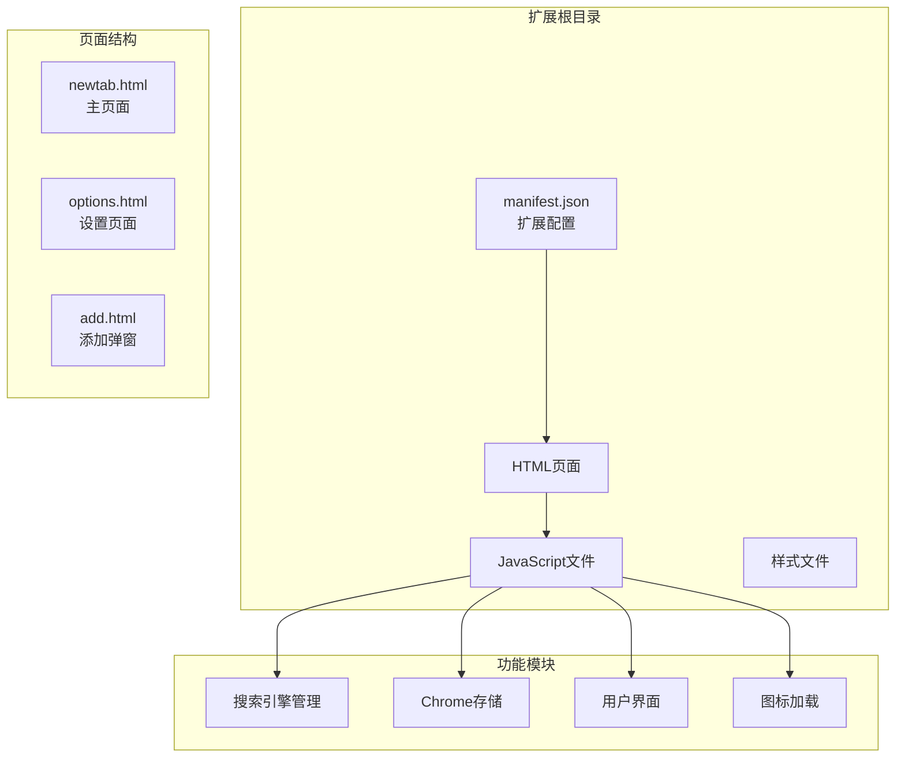
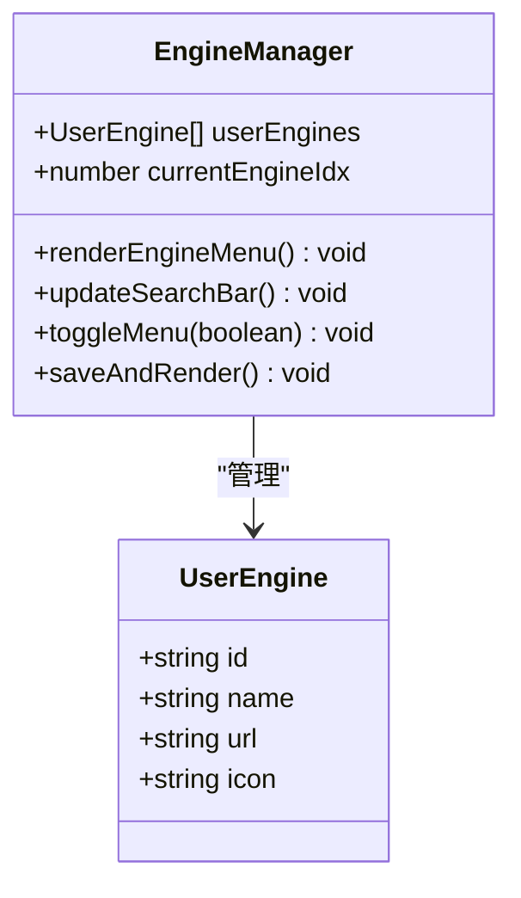
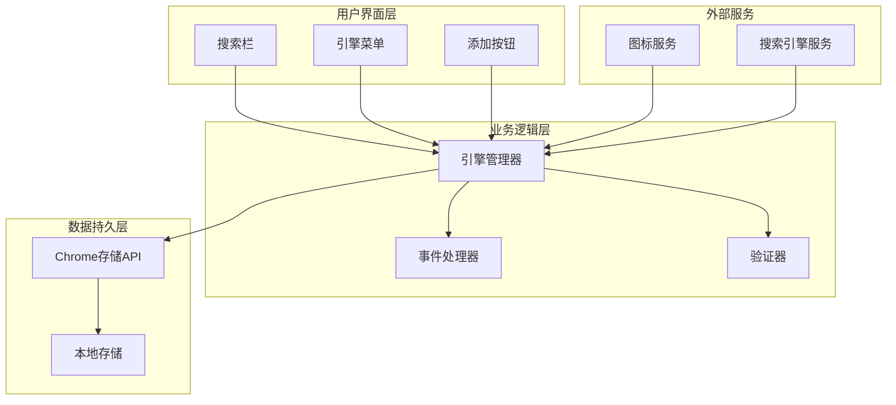
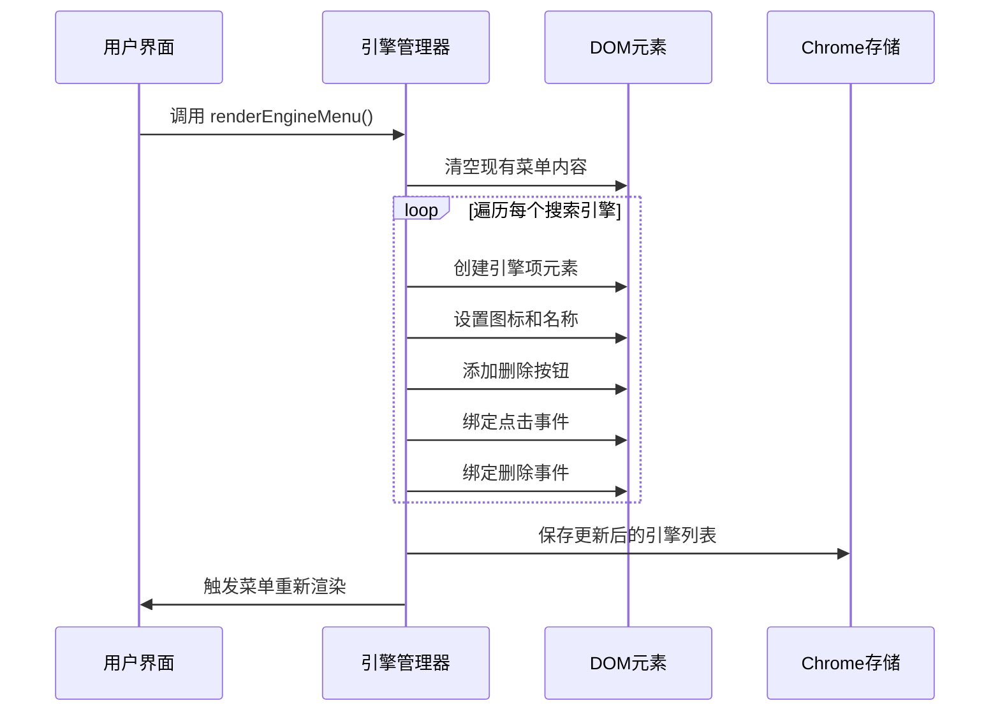
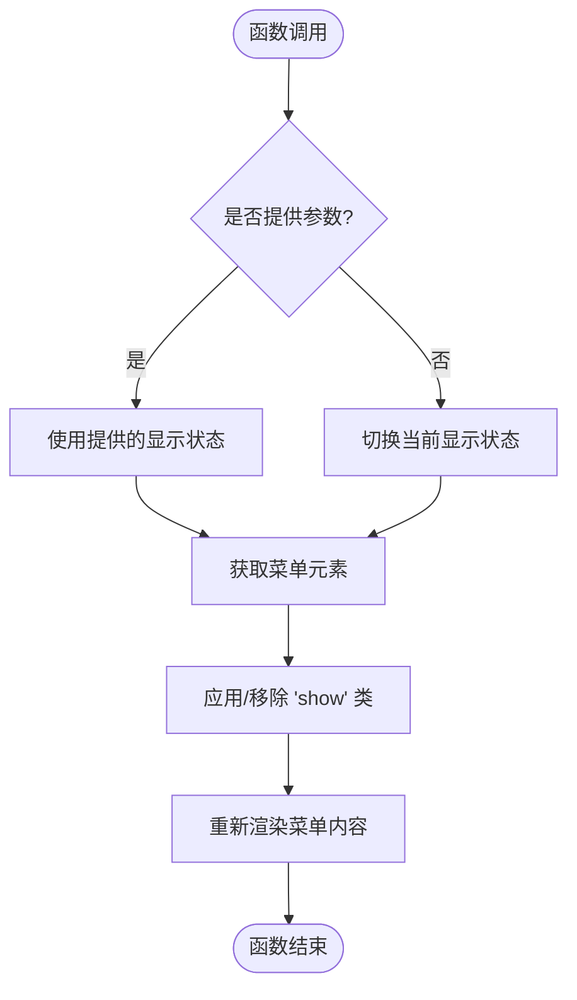
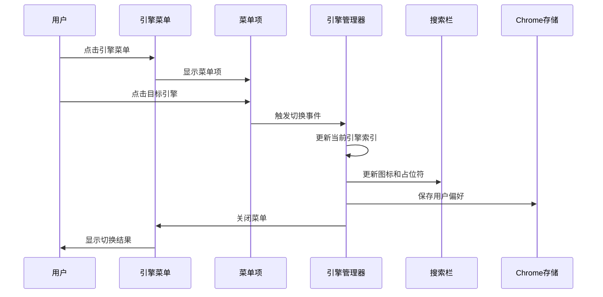
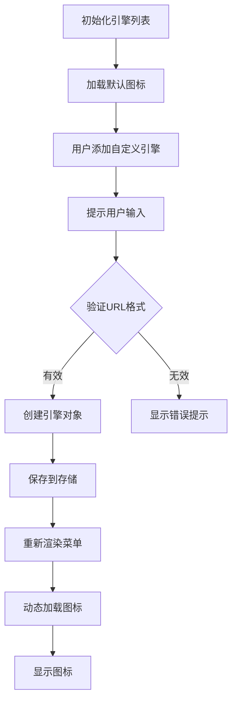
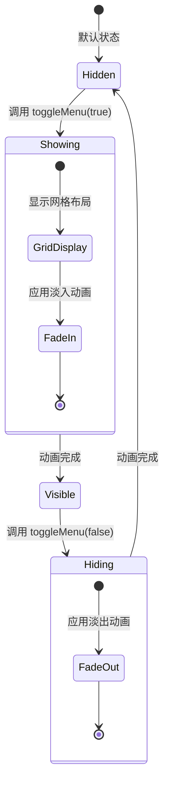
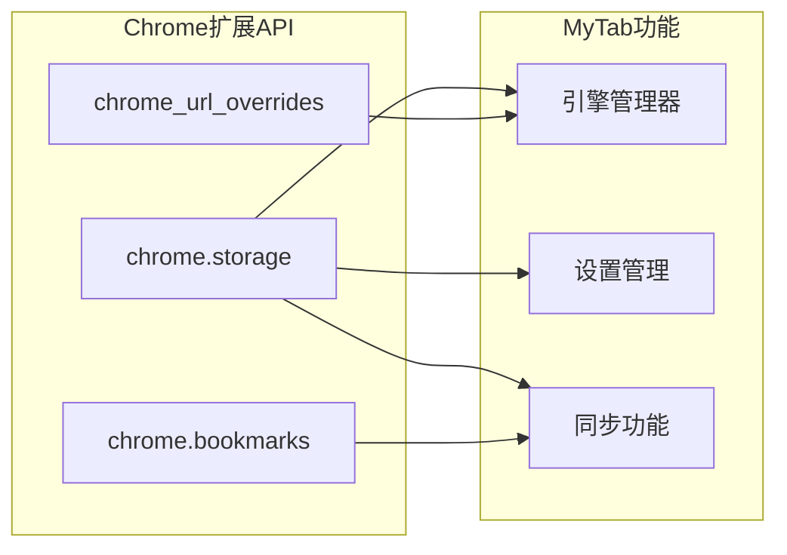
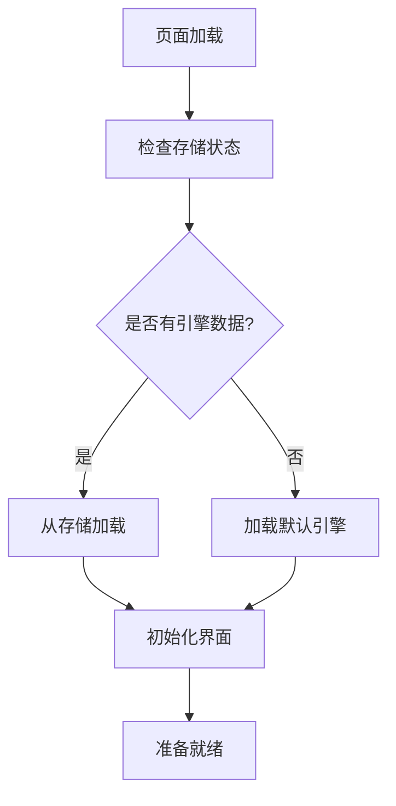

# 搜索引擎管理

<cite>
**本文档引用的文件**
- [manifest.json](file://manifest.json)
- [newtab.html](file://newtab.html)
- [newtab.js](file://newtab.js)
- [options.html](file://options.html)
- [options.js](file://options.js)
- [style.css](file://style.css)
- [add.html](file://add.html)
</cite>

## 目录
1. [简介](#简介)
2. [项目结构](#项目结构)
3. [核心组件](#核心组件)
4. [架构概览](#架构概览)
5. [详细组件分析](#详细组件分析)
6. [依赖关系分析](#依赖关系分析)
7. [性能考虑](#性能考虑)
8. [故障排除指南](#故障排除指南)
9. [结论](#结论)

## 简介

MyTab扩展的搜索引擎管理功能是一个完整的用户自定义搜索引擎解决方案，允许用户添加、删除、切换和管理多个搜索引擎。该功能集成了Chrome扩展API，提供了现代化的UI设计和流畅的用户体验。

该系统的核心特性包括：
- 用户自定义搜索引擎的动态管理
- 搜索引擎图标的动态加载
- 响应式菜单界面设计
- 与Chrome存储API的无缝集成
- 流畅的展开收起动画效果

## 项目结构

MyTab扩展采用模块化架构，主要由以下几个关键部分组成：

**图表来源**
- [manifest.json](file://manifest.json#L1-L13)
- [newtab.html](file://newtab.html#L1-L64)

**章节来源**
- [manifest.json](file://manifest.json#L1-L13)
- [newtab.html](file://newtab.html#L1-L64)

## 核心组件

### 搜索引擎数据结构

系统使用数组形式的用户引擎列表来管理搜索引擎配置：

**图表来源**
- [newtab.js](file://newtab.js#L223-L227)
- [newtab.js](file://newtab.js#L231-L302)

每个搜索引擎对象包含以下属性：
- `id`: 唯一标识符（用于删除操作）
- `name`: 搜索引擎显示名称
- `url`: 搜索URL模板（需包含搜索词占位符）
- `icon`: 图标URL地址

### 默认搜索引擎配置

系统预设了三个主流搜索引擎作为初始配置：

| 引擎 | 名称 | URL模板 | 图标 |
|------|------|---------|------|
| bing | 必应 | https://www.bing.com/search?q= | https://www.bing.com/favicon.ico |
| google | Google | https://www.google.com/search?q= | https://www.google.com/favicon.ico |
| baidu | 百度 | https://www.baidu.com/s?wd= | https://www.baidu.com/favicon.ico |

**章节来源**
- [newtab.js](file://newtab.js#L223-L227)

## 架构概览

搜索引擎管理系统采用分层架构设计，确保功能模块之间的清晰分离：

**图表来源**
- [newtab.js](file://newtab.js#L231-L302)
- [newtab.js](file://newtab.js#L270-L273)

## 详细组件分析

### renderEngineMenu() 函数实现

`renderEngineMenu()` 是搜索引擎菜单渲染的核心函数，负责将用户引擎列表转换为可视化的菜单界面：

**图表来源**
- [newtab.js](file://newtab.js#L231-L262)

该函数的关键实现特点：
1. **动态内容生成**: 使用DOM操作实时创建菜单项
2. **事件绑定**: 为每个菜单项绑定切换和删除事件
3. **循环渲染**: 支持任意数量的搜索引擎
4. **状态同步**: 自动保存更新后的状态

**章节来源**
- [newtab.js](file://newtab.js#L231-L262)

### toggleMenu() 函数显示控制逻辑

`toggleMenu()` 函数实现了菜单的展开收起控制逻辑：

**图表来源**
- [newtab.js](file://newtab.js#L270-L273)

显示控制逻辑的关键特性：
- **条件判断**: 支持显式控制和状态切换两种模式
- **CSS类管理**: 通过添加/移除CSS类实现动画效果
- **智能渲染**: 在显示时才进行菜单内容渲染

**章节来源**
- [newtab.js](file://newtab.js#L270-L273)

### 用户引擎切换交互流程

用户引擎切换涉及多个组件的协调工作：

**图表来源**
- [newtab.js](file://newtab.js#L247-L252)
- [newtab.js](file://newtab.js#L264-L268)

**章节来源**
- [newtab.js](file://newtab.js#L247-L252)
- [newtab.js](file://newtab.js#L264-L268)

### 搜索引擎图标动态加载

系统实现了智能的搜索引擎图标加载机制：

**图表来源**
- [newtab.js](file://newtab.js#L282-L294)

**章节来源**
- [newtab.js](file://newtab.js#L282-L294)

### 菜单展开收起动画效果

系统通过CSS Grid和过渡动画实现流畅的菜单交互体验：

**图表来源**
- [style.css](file://style.css#L143-L158)

**章节来源**
- [style.css](file://style.css#L143-L158)

### 响应式布局适配

系统采用灵活的响应式设计确保在不同设备上的良好体验：

| 设备类型 | 屏幕宽度 | 菜单布局 | 字体大小 |
|----------|----------|----------|----------|
| 移动设备 | < 768px | 单列布局 | 14px |
| 平板设备 | 768px-1024px | 双列布局 | 16px |
| 桌面设备 | > 1024px | 四列布局 | 18px |

**章节来源**
- [style.css](file://style.css#L154-L156)

## 依赖关系分析

### Chrome扩展API集成

搜索引擎管理功能深度集成了Chrome扩展API：

**图表来源**
- [manifest.json](file://manifest.json#L5-L12)
- [newtab.js](file://newtab.js#L26-L42)

### 外部依赖关系

系统对外部服务的依赖关系：

| 服务 | 用途 | 依赖程度 | 备注 |
|------|------|----------|------|
| Google Favicon服务 | 搜索引擎图标获取 | 高 | https://www.google.com/s2/favicons |
| GitHub API | 书签同步 | 中等 | 仅在设置功能中使用 |
| 外部网站 | 一言数据获取 | 低 | 仅用于显示励志语句 |

**章节来源**
- [manifest.json](file://manifest.json#L5-L12)
- [newtab.js](file://newtab.js#L135-L135)

## 性能考虑

### 内存管理优化

系统采用了多项内存管理策略：

1. **事件委托**: 使用事件冒泡减少事件监听器数量
2. **延迟渲染**: 菜单仅在需要时渲染内容
3. **对象复用**: 重用DOM元素而非频繁创建销毁

### 加载性能优化

**图表来源**
- [newtab.js](file://newtab.js#L300-L302)

### 动画性能优化

系统通过CSS硬件加速优化动画性能：
- 使用 `transform` 属性替代位置改变
- 应用 `backdrop-filter` 进行模糊效果
- 合理使用 `transition` 和 `animation` 属性

## 故障排除指南

### 常见问题及解决方案

#### 搜索引擎图标不显示

**问题描述**: 搜索引擎图标加载失败

**可能原因**:
1. 网络连接问题
2. 图标URL不可访问
3. CORS跨域限制

**解决步骤**:
1. 检查网络连接状态
2. 验证图标URL的有效性
3. 尝试使用备用图标地址

#### 菜单无法展开

**问题描述**: 引擎菜单无法正常显示

**可能原因**:
1. CSS类名冲突
2. JavaScript执行错误
3. 事件绑定失败

**解决步骤**:
1. 检查控制台错误信息
2. 验证CSS样式规则
3. 确认事件监听器绑定

#### 数据丢失问题

**问题描述**: 用户添加的搜索引擎在重启后消失

**可能原因**:
1. Chrome存储权限问题
2. 存储空间不足
3. 数据格式错误

**解决步骤**:
1. 检查扩展权限设置
2. 验证存储容量
3. 清理损坏的数据

**章节来源**
- [newtab.js](file://newtab.js#L296-L298)
- [newtab.js](file://newtab.js#L300-L302)

## 结论

MyTab扩展的搜索引擎管理功能展现了现代浏览器扩展开发的最佳实践。通过精心设计的架构、优雅的用户界面和强大的功能特性，该系统为用户提供了便捷的搜索引擎管理体验。

### 主要优势

1. **用户友好**: 直观的菜单界面和流畅的动画效果
2. **功能完整**: 支持添加、删除、切换和排序操作
3. **性能优秀**: 优化的渲染机制和内存管理
4. **扩展性强**: 基于Chrome API的可扩展架构

### 技术亮点

- **模块化设计**: 清晰的功能分离和职责划分
- **响应式布局**: 适配多种设备和屏幕尺寸
- **动画优化**: 基于CSS的高性能动画效果
- **数据持久化**: 稳健的Chrome存储集成

该搜索引擎管理功能为MyTab扩展增添了重要的实用价值，为用户提供了更加个性化和高效的浏览体验。