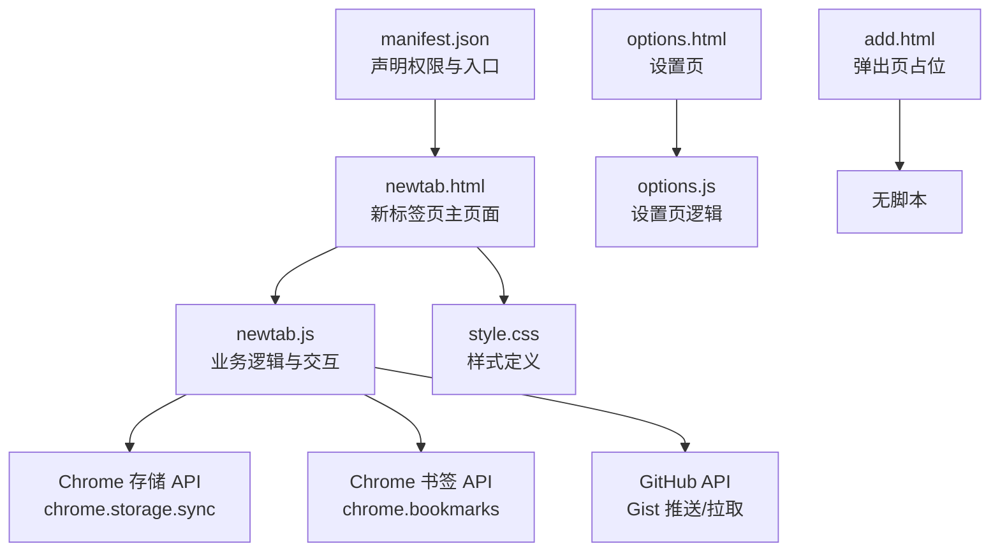
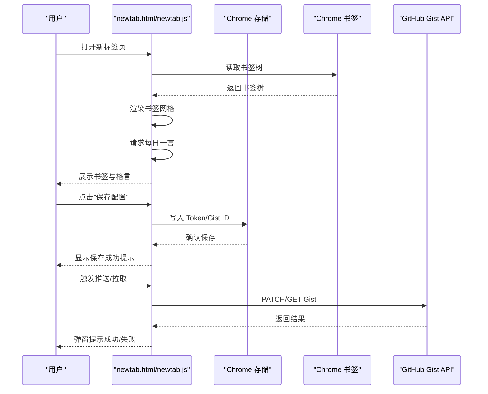
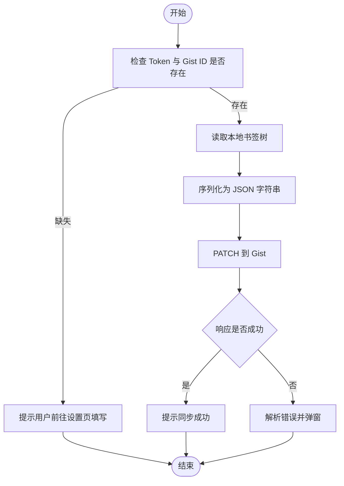
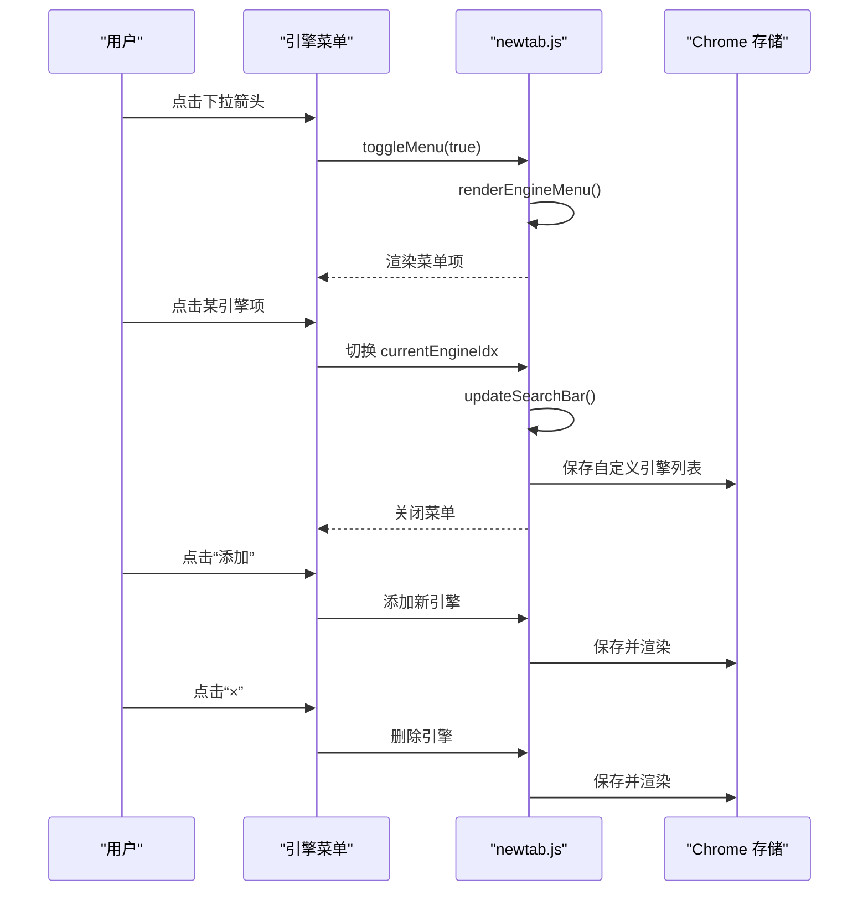
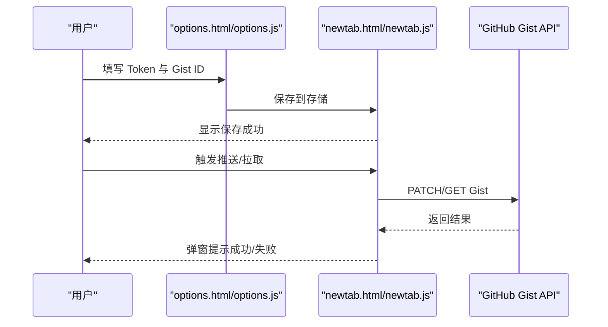
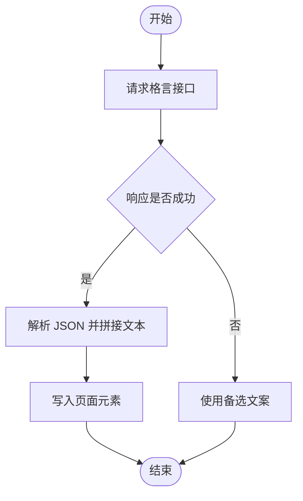
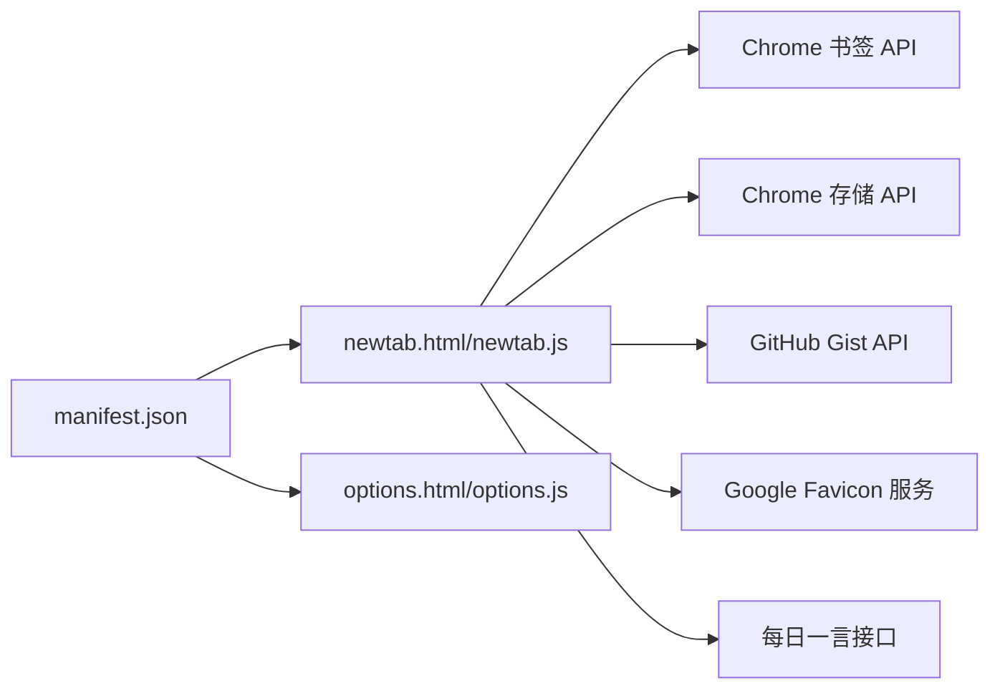

# 核心功能

<cite>
**本文引用的文件**
- [manifest.json](file://manifest.json)
- [newtab.html](file://newtab.html)
- [newtab.js](file://newtab.js)
- [options.html](file://options.html)
- [options.js](file://options.js)
- [style.css](file://style.css)
- [add.html](file://add.html)
</cite>

## 目录
1. [简介](#简介)
2. [项目结构](#项目结构)
3. [核心组件](#核心组件)
4. [架构总览](#架构总览)
5. [详细组件分析](#详细组件分析)
6. [依赖关系分析](#依赖关系分析)
7. [性能考虑](#性能考虑)
8. [故障排查指南](#故障排查指南)
9. [结论](#结论)
10. [附录](#附录)

## 简介
本文件面向 MyTab 扩展的核心功能，系统性梳理以下能力：
- 书签管理与展示：从浏览器书签树读取并以网格形式呈现；支持通过 GitHub Gist 进行双向同步。
- 搜索引擎管理：可配置多个搜索引擎，支持切换、添加、删除，并持久化到存储。
- GitHub 同步功能：基于个人访问令牌（PAT）与 Gist ID，实现书签的推送与拉取。
- 每日一言显示：从外部接口获取一句格言并在首页展示，支持点击刷新。

上述功能均基于 Manifest V3 的 Chrome 扩展权限与 API 实现，具备良好的可扩展性与用户体验。

## 项目结构
该扩展采用最小化前端结构，核心由清单文件声明权限与入口，HTML 页面承载 UI 结构，JavaScript 负责业务逻辑与交互，CSS 提供视觉样式。

图表来源
- [manifest.json](file://manifest.json#L1-L13)
- [newtab.html](file://newtab.html#L1-L64)
- [newtab.js](file://newtab.js#L1-L302)
- [options.html](file://options.html#L1-L77)
- [options.js](file://options.js#L1-L29)
- [style.css](file://style.css#L1-L199)
- [add.html](file://add.html#L1-L18)

章节来源
- [manifest.json](file://manifest.json#L1-L13)
- [newtab.html](file://newtab.html#L1-L64)
- [options.html](file://options.html#L1-L77)
- [style.css](file://style.css#L1-L199)
- [newtab.js](file://newtab.js#L1-L302)
- [options.js](file://options.js#L1-L29)
- [add.html](file://add.html#L1-L18)

## 核心组件
- 新标签页主页面与逻辑：负责渲染书签网格、展示每日一言、初始化搜索引擎菜单与交互。
- 设置页与逻辑：提供 GitHub 同步所需的 Token 与 Gist ID 的输入、校验与持久化。
- 样式层：提供毛玻璃风格、网格布局、菜单与交互态样式。
- 清单文件：声明权限（书签、存储）、覆盖新标签页、设置页与弹出页入口。

章节来源
- [newtab.html](file://newtab.html#L1-L64)
- [newtab.js](file://newtab.js#L1-L302)
- [options.html](file://options.html#L1-L77)
- [options.js](file://options.js#L1-L29)
- [style.css](file://style.css#L1-L199)
- [manifest.json](file://manifest.json#L1-L13)

## 架构总览
下图展示了从用户交互到 API 调用与数据持久化的整体流程。

图表来源
- [newtab.js](file://newtab.js#L1-L302)
- [options.js](file://options.js#L1-L29)
- [manifest.json](file://manifest.json#L1-L13)

## 详细组件分析

### 书签管理与展示
- 功能概述
  - 从浏览器书签树读取所有书签节点，过滤出链接节点并渲染为图标网格。
  - 支持通过 GitHub Gist 进行全量推送与拉取，实现跨设备同步。
- 关键实现点
  - 读取书签树：调用书签树 API 并递归遍历节点，筛选链接节点。
  - 渲染网格：为每个链接生成带站点图标与标题的卡片，点击跳转。
  - 同步流程：
    - 推送：读取本地书签树，序列化为 JSON，PATCH 至指定 Gist 文件。
    - 拉取：GET 指定 Gist 文件内容，解析后清空并重建本地书签树。
- 用户交互
  - 点击书签卡片跳转目标站点。
  - 在设置页保存 Token 与 Gist ID 后，可在扩展弹出页或控制台触发同步。
- 错误处理
  - 缺少配置时提示用户先完成设置。
  - API 响应非 2xx 时解析错误消息并弹窗提示。
  - 拉取时存在风险操作（清空本地书签），建议在生产环境增加二次确认。
- 性能与复杂度
  - 书签树遍历为 O(N)，渲染为 O(N)。
  - 大型书签库可能带来首屏渲染压力，可考虑分页或懒加载策略。

图表来源
- [newtab.js](file://newtab.js#L43-L76)

章节来源
- [newtab.js](file://newtab.js#L1-L302)

### 搜索引擎管理
- 功能概述
  - 支持多搜索引擎配置，默认包含必应、Google、百度。
  - 提供菜单选择、添加新引擎、删除引擎的能力，并持久化到存储。
- 关键实现点
  - 菜单渲染：根据当前引擎索引更新图标与占位文本。
  - 切换逻辑：点击菜单项切换当前引擎，同时更新搜索输入框占位。
  - 添加逻辑：弹窗输入名称与搜索模板，插入到引擎列表。
  - 删除逻辑：移除对应索引的引擎项，立即保存并重新渲染。
  - 存储：将自定义引擎数组写入存储，下次加载时恢复。
- 用户交互
  - 点击下拉箭头打开引擎菜单。
  - 点击引擎项切换当前引擎。
  - 点击“添加”按钮新增自定义引擎。
  - 点击引擎项右侧“×”删除引擎。
- 错误处理
  - 添加时若输入为空则忽略。
  - 删除后立即生效，建议增加二次确认以防误删。
- 与搜索输入的集成
  - 页面中保留了搜索输入与提交按钮结构，但未绑定回车与点击事件的实现代码处于注释状态。如需启用，请参考注释中的实现思路进行绑定。

图表来源
- [newtab.js](file://newtab.js#L231-L302)
- [newtab.html](file://newtab.html#L24-L35)

章节来源
- [newtab.js](file://newtab.js#L223-L302)
- [newtab.html](file://newtab.html#L24-L35)

### GitHub 同步功能
- 功能概述
  - 使用个人访问令牌（PAT）与 Gist ID，将书签树作为 JSON 文件上传至 Gist，或从 Gist 下载并重建本地书签。
- 关键实现点
  - 配置存储：设置页将 Token 与 Gist ID 写入存储，新标签页逻辑读取并校验。
  - 推送：PATCH Gist，更新 bookmarks.json 文件内容。
  - 拉取：GET Gist，解析 bookmarks.json，清空并重建本地书签树。
- 用户交互
  - 在设置页填写 Token 与 Gist ID 并保存。
  - 在扩展弹出页或控制台触发同步（当前代码中可在弹出页入口或控制台调用相应函数）。
- 错误处理
  - 缺失配置时提示用户先完成设置。
  - API 响应非 2xx 时解析错误消息并弹窗提示。
  - 拉取存在风险操作，建议在生产环境增加二次确认。
- 安全与合规
  - PAT 仅用于扩展内部同步，不应泄露给第三方。
  - 建议定期轮换 Token 并限制权限范围。

图表来源
- [options.js](file://options.js#L1-L29)
- [newtab.js](file://newtab.js#L43-L94)

章节来源
- [options.html](file://options.html#L1-L77)
- [options.js](file://options.js#L1-L29)
- [newtab.js](file://newtab.js#L43-L94)

### 每日一言显示
- 功能概述
  - 从外部接口获取一句格言，展示在首页，支持点击刷新。
- 关键实现点
  - 请求接口：GET 格言接口，解析 JSON 并提取文本与来源。
  - 渲染：将文本与来源拼接后写入页面元素。
  - 备选文案：请求失败或异常时显示预设文案。
- 用户交互
  - 点击“每日一言”区域触发刷新。
- 错误处理
  - 网络异常或解析失败时降级为备选文案，并记录错误日志。

图表来源
- [newtab.js](file://newtab.js#L108-L126)

章节来源
- [newtab.js](file://newtab.js#L108-L126)
- [newtab.html](file://newtab.html#L55-L57)

## 依赖关系分析
- 权限与入口
  - 书签与存储权限用于读取书签与持久化配置。
  - 新标签页覆盖与设置页入口由清单文件声明。
- 组件耦合
  - newtab.js 与 options.js 通过 Chrome 存储 API 共享配置。
  - newtab.js 依赖 Chrome 书签 API 与 GitHub API。
- 外部依赖
  - Google 站点图标服务用于生成书签图标。
  - 第三方格言接口用于每日一言展示。

图表来源
- [manifest.json](file://manifest.json#L1-L13)
- [newtab.js](file://newtab.js#L1-L302)
- [options.js](file://options.js#L1-L29)

章节来源
- [manifest.json](file://manifest.json#L1-L13)
- [newtab.js](file://newtab.js#L1-L302)
- [options.js](file://options.js#L1-L29)

## 性能考虑
- 书签渲染
  - 对于大型书签库，建议采用虚拟滚动或分页加载，减少一次性 DOM 插入带来的卡顿。
- 图标加载
  - Google Favicon 服务可能不稳定，建议缓存图标或提供占位图。
- 网络请求
  - 每日一言与 Gist API 均为外部请求，建议增加超时与重试机制。
- 存储访问
  - 批量写入存储时避免频繁触发回调，可合并多次写入为一次。

## 故障排查指南
- 无法看到书签
  - 检查浏览器书签权限是否授予。
  - 确认书签树读取逻辑是否正常执行。
- 同步失败
  - 确认 Token 与 Gist ID 是否正确保存。
  - 检查网络连通性与 GitHub API 可达性。
  - 查看控制台错误日志，定位具体响应码与错误信息。
- 每日一言不显示
  - 检查网络请求是否成功，接口是否返回有效 JSON。
  - 确认页面元素是否存在且可写入。
- 引擎菜单不可用
  - 确认 HTML 结构与事件绑定是否正确。
  - 检查存储中自定义引擎列表是否被正确读取与渲染。

章节来源
- [newtab.js](file://newtab.js#L43-L94)
- [newtab.js](file://newtab.js#L108-L126)
- [options.js](file://options.js#L1-L29)

## 结论
MyTab 扩展围绕“书签管理 + 搜索引擎 + 同步 + 每日一言”的核心体验构建，具备清晰的功能边界与可扩展的架构。通过 Chrome 书签与存储 API，结合 GitHub Gist，实现了跨设备的书签同步；通过可配置的搜索引擎菜单，提升了搜索效率；通过每日一言增强每日打开新标签页的仪式感。建议在生产环境中进一步完善安全与稳定性（如二次确认、错误重试、图标缓存等），以提升用户体验与可靠性。

## 附录

### API 与配置说明
- 配置项
  - githubToken：GitHub 个人访问令牌（PAT），用于授权 Gist 访问。
  - gistId：目标 Gist 的 ID。
- 存储键
  - githubToken：字符串。
  - gistId：字符串。
  - customEngines：数组，包含用户自定义搜索引擎对象。
- 返回值
  - 书签树：JSON 对象，包含层级结构与节点信息。
  - Gist 响应：标准 HTTP 状态码与 JSON 错误体。
  - 每日一言：包含文本与来源的 JSON 对象。
- 错误处理
  - 缺失配置：提示用户前往设置页填写。
  - API 非 2xx：解析错误消息并弹窗提示。
  - 网络异常：降级为备选文案并记录日志。

章节来源
- [options.js](file://options.js#L1-L29)
- [newtab.js](file://newtab.js#L43-L94)
- [newtab.js](file://newtab.js#L108-L126)

### 最佳实践建议
- 安全
  - 严格保护 Token，避免在日志或公开渠道泄露。
  - 定期轮换 Token 并限制权限范围。
- 可靠性
  - 在拉取前增加二次确认，避免误操作导致本地书签丢失。
  - 为外部接口请求增加超时与重试策略。
- 用户体验
  - 为大型书签库提供分页或搜索过滤功能。
  - 优化图标加载失败时的占位图与降级策略。
  - 为搜索引擎菜单提供排序与常用引擎推荐。