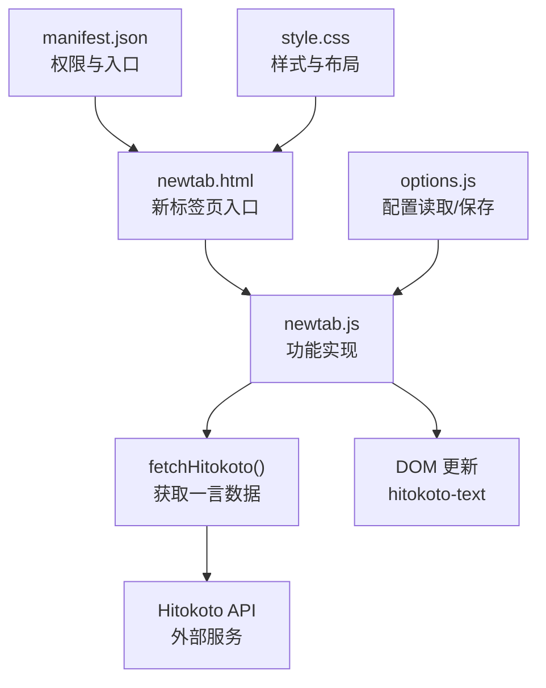
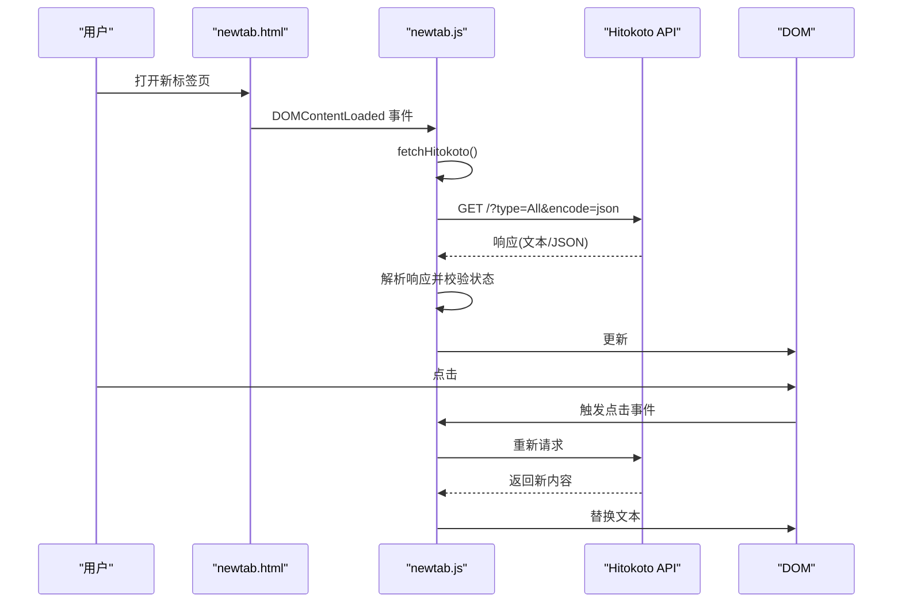
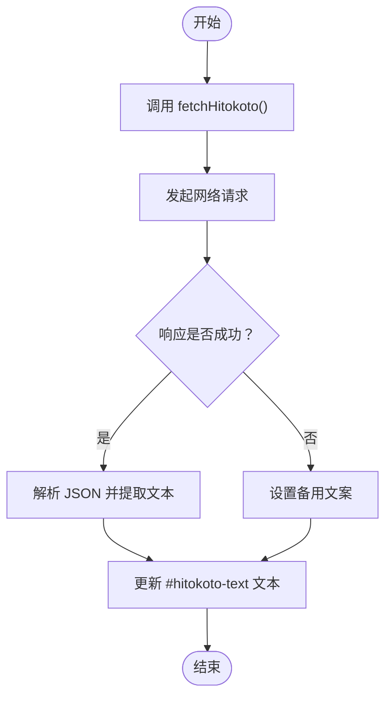
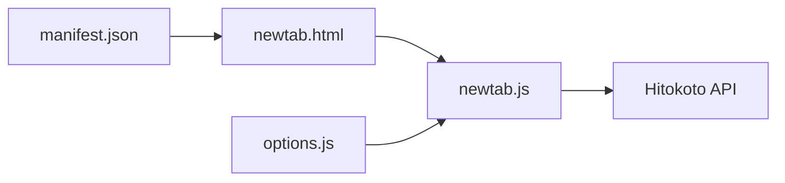

# 每日一言显示

<cite>
**本文引用的文件**
- [newtab.js](file://newtab.js)
- [newtab.html](file://newtab.html)
- [manifest.json](file://manifest.json)
- [options.js](file://options.js)
- [style.css](file://style.css)
</cite>

## 目录
1. [简介](#简介)
2. [项目结构](#项目结构)
3. [核心组件](#核心组件)
4. [架构总览](#架构总览)
5. [详细组件分析](#详细组件分析)
6. [依赖关系分析](#依赖关系分析)
7. [性能考虑](#性能考虑)
8. [故障排查指南](#故障排查指南)
9. [结论](#结论)
10. [附录](#附录)

## 简介
本文件围绕 MyTab 扩展中的“每日一言”功能进行系统化技术文档整理，重点覆盖以下方面：
- Hitokoto API 的集成方式与请求流程
- 异步数据获取与错误处理机制
- 内容展示的动态更新逻辑与交互设计
- 刷新时机、缓存策略与本地存储机制
- 用户自定义配置选项与隐私保护建议
- 性能监控与用户体验优化方案

## 项目结构
该扩展采用 Manifest V3 架构，核心页面为新标签页，通过脚本注入实现功能模块化。与“每日一言”相关的文件与职责如下：
- newtab.html：承载“每日一言”的容器与初始占位文本
- newtab.js：实现“每日一言”的获取、渲染与交互
- manifest.json：声明权限与入口页
- options.js：提供配置页面的读写逻辑（用于后续扩展“每日一言”配置项）
- style.css：提供“每日一言”区域的视觉样式

图表来源
- [newtab.html](file://newtab.html#L55-L57)
- [newtab.js](file://newtab.js#L108-L126)
- [manifest.json](file://manifest.json#L1-L13)
- [options.js](file://options.js#L1-L29)
- [style.css](file://style.css#L1-L199)

章节来源
- [newtab.html](file://newtab.html#L1-L64)
- [newtab.js](file://newtab.js#L1-L302)
- [manifest.json](file://manifest.json#L1-L13)
- [options.js](file://options.js#L1-L29)
- [style.css](file://style.css#L1-L199)

## 核心组件
- “每日一言”容器与占位文本：newtab.html 提供 id 为 hitokoto-container 与 hitokoto-text 的元素，初始显示“加载中…”
- 数据获取函数：newtab.js 中的 fetchHitokoto() 使用 fetch 发起异步请求，解析响应并更新 DOM
- 错误降级：当网络异常或响应非 OK 时，显示预设的备用文案
- 交互刷新：点击“每日一言”容器可触发重新获取
- 初始化加载：页面 DOMContentLoaded 时自动拉取一次数据

章节来源
- [newtab.html](file://newtab.html#L55-L57)
- [newtab.js](file://newtab.js#L108-L126)
- [newtab.js](file://newtab.js#L212-L221)

## 架构总览
下图展示了“每日一言”从页面加载到内容渲染的关键调用链路与外部依赖：

图表来源
- [newtab.html](file://newtab.html#L55-L57)
- [newtab.js](file://newtab.js#L108-L126)
- [newtab.js](file://newtab.js#L212-L221)

## 详细组件分析

### 组件一：Hitokoto API 集成与数据获取
- 请求地址与参数：使用固定 URL，参数类型为 All，返回 JSON
- 请求方法：GET
- 响应处理：检查响应状态，解析 JSON 并提取文本字段；若失败则执行降级逻辑
- DOM 更新：将文本写入 id 为 hitokoto-text 的段落元素

图表来源
- [newtab.js](file://newtab.js#L108-L126)

章节来源
- [newtab.js](file://newtab.js#L108-L126)

### 组件二：异步处理与错误处理机制
- 异常捕获：try/catch 包裹 fetch 与 JSON 解析，避免未处理异常导致页面崩溃
- 状态码判断：仅在 response.ok 为真时解析数据，否则走降级路径
- 降级文案：分别针对网络异常与响应失败设置不同提示语句
- 用户体验：点击容器可手动刷新，提升交互可控性

章节来源
- [newtab.js](file://newtab.js#L108-L126)
- [newtab.js](file://newtab.js#L220-L221)

### 组件三：内容展示与动态更新
- 初始占位：newtab.html 中的 #hitokoto-text 初始显示“加载中…”
- 渲染逻辑：fetchHitokoto() 将获取到的内容写入 #hitokoto-text
- 交互刷新：绑定点击事件到 #hitokoto-container，再次触发 fetchHitokoto()

章节来源
- [newtab.html](file://newtab.html#L55-L57)
- [newtab.js](file://newtab.js#L212-L221)

### 组件四：刷新时机与交互设计
- 页面加载：DOMContentLoaded 时自动拉取一次
- 手动刷新：点击“每日一言”区域触发刷新
- 交互反馈：点击后立即响应，避免重复点击造成并发请求（当前实现未做防抖，可按需增强）

章节来源
- [newtab.js](file://newtab.js#L212-L221)

### 组件五：缓存策略与本地存储机制
- 当前实现：未引入本地缓存或持久化存储，每次刷新均发起网络请求
- 建议策略：
  - 本地缓存：使用 chrome.storage.local 缓存当日内容与时间戳，超过 24 小时再请求
  - 降级策略：缓存过期时仍可显示上次成功内容，避免空白
  - 配置项：允许用户关闭“每日一言”，或选择刷新频率（如每小时）

章节来源
- [newtab.js](file://newtab.js#L108-L126)

### 组件六：用户自定义配置选项
- 现状：配置页面仅支持 GitHub 同步相关设置（token 与 gistId），未提供“每日一言”相关配置
- 建议扩展：
  - 新增开关：启用/禁用“每日一言”
  - 新增选项：刷新策略（立即、每小时、每日）、备用文案、主题样式等
  - 与 options.js 对接：读取/保存配置项，并在 newtab.js 中生效

章节来源
- [options.js](file://options.js#L1-L29)
- [newtab.js](file://newtab.js#L108-L126)

### 组件七：隐私保护与安全建议
- 数据最小化：仅请求必要接口，不携带用户敏感信息
- 传输安全：确保 API 为 HTTPS，避免明文传输
- 本地存储：如引入缓存，避免存储个人可识别信息；使用 chrome.storage 的默认隔离策略
- 第三方依赖：对外部 API 的可用性与稳定性保持警惕，准备降级方案

章节来源
- [newtab.js](file://newtab.js#L108-L126)

### 组件八：性能监控与优化建议
- 超时处理：为 fetch 设置合理的 timeout，避免长时间阻塞 UI
- 并发控制：限制同时发起的请求数量，避免重复刷新造成资源浪费
- 预加载与懒加载：根据页面滚动或用户行为决定是否提前请求
- 错误统计：记录失败次数与错误类型，便于后续优化

章节来源
- [newtab.js](file://newtab.js#L108-L126)

## 依赖关系分析
- newtab.js 依赖浏览器环境的 fetch 与 DOM API
- newtab.html 提供 DOM 结构与初始占位
- manifest.json 声明权限与入口页，保证新标签页覆盖生效
- options.js 提供配置读取/保存能力，为后续扩展“每日一言”配置项提供基础

图表来源
- [manifest.json](file://manifest.json#L1-L13)
- [newtab.html](file://newtab.html#L1-L64)
- [newtab.js](file://newtab.js#L1-L302)
- [options.js](file://options.js#L1-L29)

章节来源
- [manifest.json](file://manifest.json#L1-L13)
- [newtab.html](file://newtab.html#L1-L64)
- [newtab.js](file://newtab.js#L1-L302)
- [options.js](file://options.js#L1-L29)

## 性能考虑
- 网络请求优化：为 fetch 设置合理超时（例如 5 秒），并在 UI 上提供加载指示
- 防抖与节流：对点击刷新进行防抖，避免频繁请求
- 缓存策略：引入本地缓存，减少重复请求；缓存过期后异步刷新
- 错误恢复：在网络波动时快速降级，保证页面可用性

## 故障排查指南
- 无法获取内容
  - 检查网络连通性与 API 可达性
  - 查看控制台是否有异常堆栈
  - 确认 response.ok 条件是否满足
- 显示空白或占位文本
  - 确认 DOM 元素 id 是否正确
  - 检查样式是否覆盖了文本显示
- 刷新无效
  - 确认点击事件是否绑定到 #hitokoto-container
  - 检查是否存在重复点击导致的并发问题

章节来源
- [newtab.js](file://newtab.js#L108-L126)
- [newtab.js](file://newtab.js#L212-L221)
- [newtab.html](file://newtab.html#L55-L57)

## 结论
当前实现简洁可靠，具备基本的异步获取、错误降级与手动刷新能力。为进一步提升稳定性与用户体验，建议引入缓存策略、超时控制、配置项扩展与性能监控，并完善隐私保护与错误统计机制。这些改进可在不改变现有 UI 的前提下平滑集成。

## 附录
- API 地址与参数：见 fetchHitokoto() 中的 URL 定义
- DOM 元素：#hitokoto-container 与 #hitokoto-text
- 初始化与刷新：DOMContentLoaded 自动拉取；点击容器手动刷新
- 配置入口：options 页面（当前用于 GitHub 同步，可扩展“每日一言”相关设置）