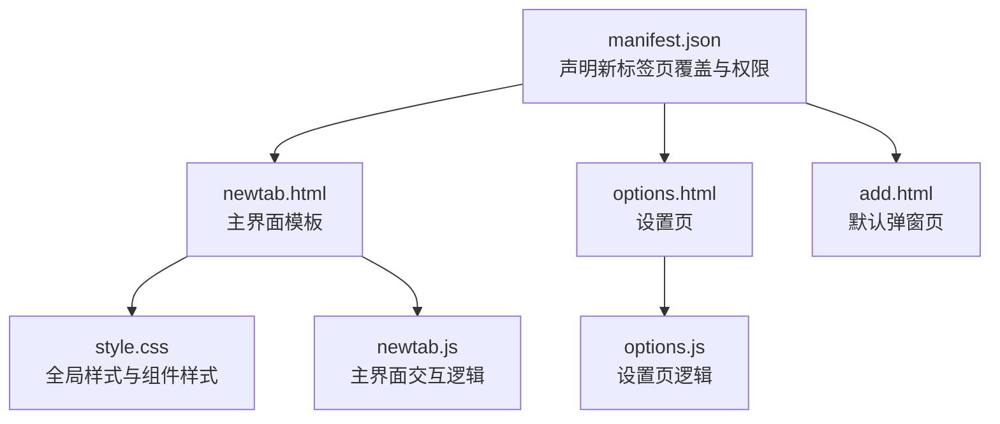
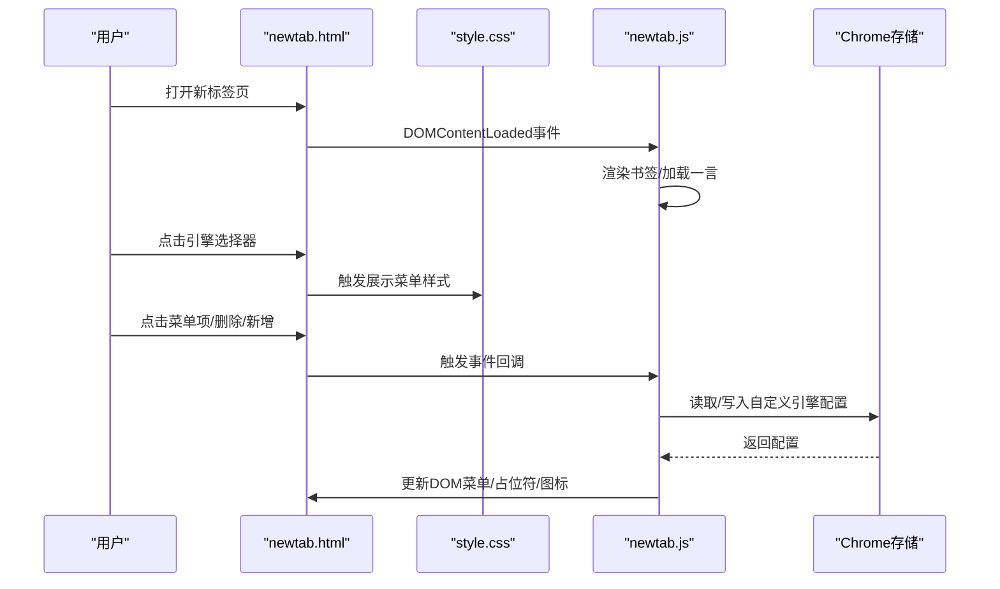
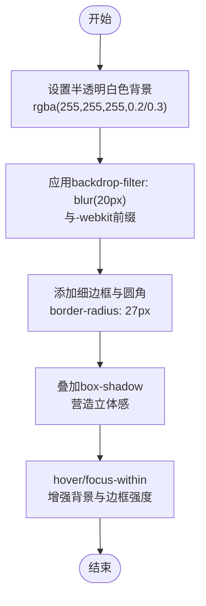
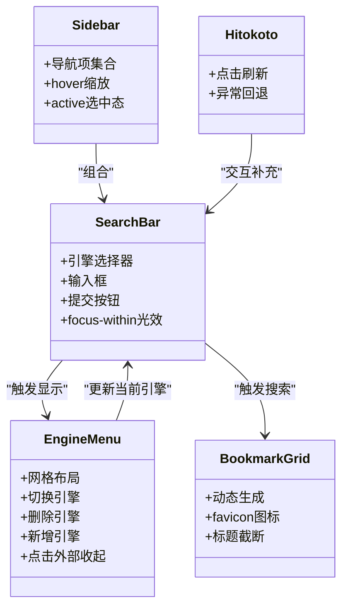
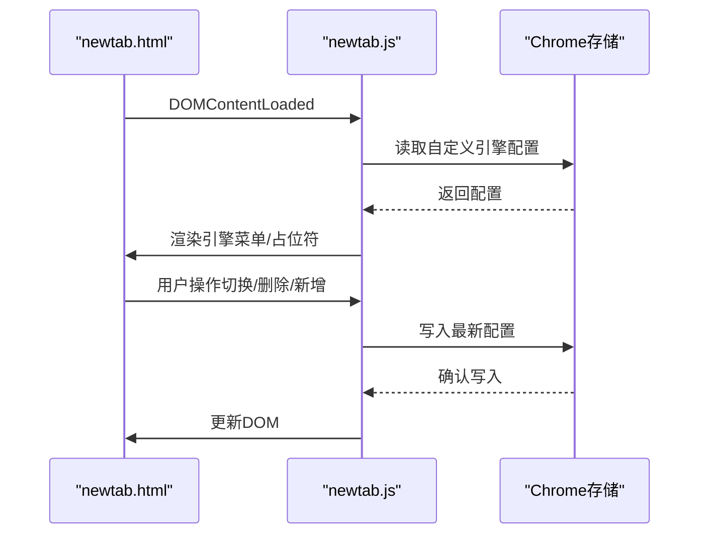
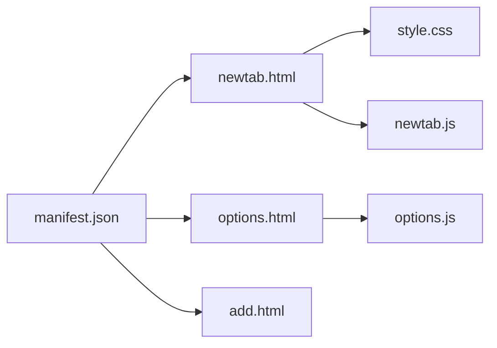

# 用户界面设计

<cite>
**本文引用的文件**
- [style.css](file://style.css)
- [newtab.html](file://newtab.html)
- [options.html](file://options.html)
- [manifest.json](file://manifest.json)
- [newtab.js](file://newtab.js)
- [options.js](file://options.js)
- [add.html](file://add.html)
</cite>

## 目录
1. [简介](#简介)
2. [项目结构](#项目结构)
3. [核心组件](#核心组件)
4. [架构总览](#架构总览)
5. [详细组件分析](#详细组件分析)
6. [依赖关系分析](#依赖关系分析)
7. [性能考量](#性能考量)
8. [故障排查指南](#故障排查指南)
9. [结论](#结论)
10. [附录](#附录)

## 简介
本文件面向MyTab扩展的用户界面设计，系统化梳理其CSS样式体系、响应式布局与视觉效果技术，重点解析毛玻璃效果的实现原理、颜色与字体排版规范、UI组件结构与交互状态管理，并提供定制与主题扩展指南。文档同时覆盖CSS变量、媒体查询与跨浏览器兼容策略，帮助开发者高效理解与扩展UI设计。

## 项目结构
MyTab扩展采用极简的前端三件套：HTML页面、CSS样式与JavaScript脚本，配合Chrome扩展清单进行页面覆盖与选项页配置。关键文件职责如下：
- newtab.html：新标签页主界面，承载背景墙纸、侧边导航、搜索栏与书签网格等核心区域。
- style.css：全局样式与组件样式，定义毛玻璃、阴影、过渡动画与交互态。
- newtab.js：主界面交互逻辑，包括书签渲染、搜索引擎菜单、一言展示与自定义引擎管理。
- options.html：设置页，用于配置GitHub同步参数。
- options.js：设置页逻辑，负责读写Chrome存储。
- manifest.json：声明新标签页覆盖、选项页与权限。
- add.html：默认弹窗页面（当前为空壳），可作为后续功能入口。

图表来源
- [manifest.json](file://manifest.json#L1-L13)
- [newtab.html](file://newtab.html#L1-L64)
- [options.html](file://options.html#L1-L77)
- [add.html](file://add.html#L1-L18)
- [style.css](file://style.css#L1-L199)
- [newtab.js](file://newtab.js#L1-L302)
- [options.js](file://options.js#L1-L29)

章节来源
- [manifest.json](file://manifest.json#L1-L13)
- [newtab.html](file://newtab.html#L1-L64)
- [options.html](file://options.html#L1-L77)
- [add.html](file://add.html#L1-L18)
- [style.css](file://style.css#L1-L199)
- [newtab.js](file://newtab.js#L1-L302)
- [options.js](file://options.js#L1-L29)

## 核心组件
- 壁纸背景层：固定定位的背景墙纸，通过滤镜降低亮度以提升前景可读性。
- 侧边导航：窄栏布局，使用毛玻璃背景与圆角过渡，提供悬停缩放与高亮态。
- 搜索容器：居中布局，包含引擎选择器、输入框与提交按钮；支持菜单展开与聚焦光效。
- 引擎菜单：网格布局展示可用搜索引擎，支持切换、删除与新增。
- 书签网格：动态生成书签图标与标题，使用favicon与截断标题增强可读性。
- 一言展示：随机语句展示区，支持点击刷新。
- 设置页：表单字段与保存逻辑，基于Chrome存储持久化配置。

章节来源
- [style.css](file://style.css#L13-L20)
- [style.css](file://style.css#L24-L31)
- [style.css](file://style.css#L66-L95)
- [style.css](file://style.css#L142-L199)
- [newtab.html](file://newtab.html#L10-L64)
- [newtab.js](file://newtab.js#L108-L126)
- [newtab.js](file://newtab.js#L130-L150)
- [newtab.js](file://newtab.js#L223-L302)
- [options.html](file://options.html#L61-L77)
- [options.js](file://options.js#L1-L29)

## 架构总览
下图展示从用户交互到DOM更新与存储交互的整体流程，涵盖搜索菜单、书签渲染与设置页保存。

图表来源
- [newtab.html](file://newtab.html#L1-L64)
- [style.css](file://style.css#L142-L199)
- [newtab.js](file://newtab.js#L223-L302)
- [manifest.json](file://manifest.json#L5-L6)

## 详细组件分析

### 毛玻璃效果实现原理
- 关键属性：backdrop-filter: blur(...) 与 -webkit-backdrop-filter: blur(...)，配合半透明背景与边框实现“通透”视觉。
- 圆角与阴影：通过border-radius与box-shadow营造柔和边界与立体感。
- 交互反馈：hover与focus-within改变背景、边框与阴影强度，形成层次变化。
- 兼容性：针对Webkit内核添加前缀，确保在部分浏览器下的backdrop-filter生效。

图表来源
- [style.css](file://style.css#L74-L95)

章节来源
- [style.css](file://style.css#L74-L95)

### 颜色方案与字体排版规范
- 颜色方案：
  - 主体文字：浅色系（如白色），用于高对比度文本。
  - 背景与蒙层：低饱和度深色与半透明白，保证前景可读性。
  - 交互元素：hover与active态通过透明度与尺寸变化提供反馈。
- 字体排版：
  - 页面级字体：优先使用系统中文字体族，确保在不同平台一致呈现。
  - 文本阴影：对小字号文本添加阴影，提升在复杂背景上的可读性。
- 色彩变量：通过CSS变量集中管理毛玻璃背景、边框与文本色，便于主题化与统一维护。

章节来源
- [style.css](file://style.css#L1-L5)
- [style.css](file://style.css#L7-L11)
- [style.css](file://style.css#L61-L61)
- [style.css](file://style.css#L124-L132)

### 响应式布局与媒体查询
- 当前未发现显式的@media规则，整体布局依赖Flexbox与相对单位，适配常见桌面分辨率。
- 建议在扩展功能时引入媒体查询，针对窄屏设备调整侧边栏宽度、搜索栏尺寸与网格列数，以提升移动端体验。

章节来源
- [style.css](file://style.css#L22-L22)
- [style.css](file://style.css#L66-L95)
- [style.css](file://style.css#L142-L158)

### UI组件结构与交互状态管理
- 侧边导航：
  - 结构：固定宽高、圆角、过渡与悬停缩放。
  - 状态：active类控制当前选中态；hover提供视觉反馈。
- 搜索栏：
  - 结构：引擎选择器、输入框、提交按钮组合为统一容器。
  - 状态：focus-within触发光效；placeholder根据当前引擎动态更新。
- 引擎菜单：
  - 结构：网格布局，支持切换、删除与新增。
  - 状态：点击外部区域收起；hover显示删除按钮。
- 书签网格：
  - 结构：动态生成，使用favicon与截断标题。
  - 状态：点击打开目标链接。
- 一言展示：
  - 结构：点击刷新，异常时回退文案。
  - 状态：加载中/成功/失败三种状态。

图表来源
- [newtab.html](file://newtab.html#L13-L59)
- [style.css](file://style.css#L24-L31)
- [style.css](file://style.css#L66-L95)
- [style.css](file://style.css#L142-L199)
- [newtab.js](file://newtab.js#L223-L302)

章节来源
- [newtab.html](file://newtab.html#L13-L59)
- [style.css](file://style.css#L24-L31)
- [style.css](file://style.css#L66-L95)
- [style.css](file://style.css#L142-L199)
- [newtab.js](file://newtab.js#L223-L302)

### 数据流与状态持久化
- 自定义引擎配置通过Chrome存储进行持久化，页面加载时读取，菜单操作后写回。
- 书签渲染与一言展示在页面加载时执行，支持点击刷新。

图表来源
- [newtab.js](file://newtab.js#L299-L302)
- [newtab.js](file://newtab.js#L223-L268)

章节来源
- [newtab.js](file://newtab.js#L299-L302)
- [newtab.js](file://newtab.js#L223-L268)

### 跨浏览器兼容性处理
- backdrop-filter前缀：为Webkit内核添加-webkit-backdrop-filter，提升在部分浏览器下的毛玻璃效果一致性。
- 语法兼容：使用标准backdrop-filter与-webkit前缀并存，避免现代浏览器忽略。
- 建议：在非Webkit内核环境下，可通过降级方案（如纯色背景或低模糊值）保证基本可用性。

章节来源
- [style.css](file://style.css#L82-L83)

## 依赖关系分析
- newtab.html依赖style.css提供样式，依赖newtab.js提供交互。
- options.html依赖options.js提供设置逻辑。
- manifest.json声明新标签页覆盖与权限，使newtab.html成为默认新标签页。
- add.html当前为空壳，可在未来扩展为功能入口。

图表来源
- [manifest.json](file://manifest.json#L6-L12)
- [newtab.html](file://newtab.html#L7-L62)
- [options.html](file://options.html#L58-L76)
- [add.html](file://add.html#L9-L16)
- [style.css](file://style.css#L1-L199)
- [newtab.js](file://newtab.js#L1-L302)
- [options.js](file://options.js#L1-L29)

章节来源
- [manifest.json](file://manifest.json#L6-L12)
- [newtab.html](file://newtab.html#L7-L62)
- [options.html](file://options.html#L58-L76)
- [add.html](file://add.html#L9-L16)
- [style.css](file://style.css#L1-L199)
- [newtab.js](file://newtab.js#L1-L302)
- [options.js](file://options.js#L1-L29)

## 性能考量
- 图片与字体：favicon与背景墙纸均来自网络，建议在扩展打包时内置资源或缓存策略，减少首屏等待。
- 动画与过渡：适度的transition与backdrop-filter可能影响低端设备性能，建议在设置页提供“性能模式”开关以降低动画强度。
- DOM更新：书签网格与引擎菜单的频繁更新需注意批量插入与去重，避免重复渲染。

## 故障排查指南
- 毛玻璃效果不生效：
  - 检查backdrop-filter与-webkit前缀是否正确添加。
  - 确认背景具备足够的对比度与透明度。
- 搜索菜单无法关闭：
  - 确认点击空白处的事件绑定是否被其他元素阻止冒泡。
- 书签不显示：
  - 检查Chrome存储中自定义引擎配置是否正确写入。
  - 确认书签权限是否已授予。
- 设置页保存无效：
  - 检查Chrome存储写入回调是否执行，以及字段是否为空。

章节来源
- [style.css](file://style.css#L82-L83)
- [newtab.js](file://newtab.js#L296-L298)
- [newtab.js](file://newtab.js#L299-L302)
- [options.js](file://options.js#L10-L27)

## 结论
MyTab扩展的UI设计以简洁与功能性为核心，通过毛玻璃与阴影营造现代感，借助CSS变量与Flexbox实现统一风格与灵活布局。交互层面通过事件驱动与Chrome存储实现状态持久化，满足个性化需求。建议在后续版本中引入媒体查询与性能模式，进一步完善跨设备与跨浏览器体验。

## 附录

### CSS变量使用指南
- 建议将常用颜色与透明度集中管理于:root，便于主题切换与品牌定制。
- 示例变量：毛玻璃背景、边框与文本色，便于在多个组件中复用。

章节来源
- [style.css](file://style.css#L1-L5)

### 主题修改建议
- 调整:root中的颜色变量即可快速切换主题色板。
- 修改backdrop-filter的模糊半径与透明度，平衡美观与性能。
- 通过媒体查询在窄屏设备上调整布局密度与控件尺寸。

章节来源
- [style.css](file://style.css#L1-L5)
- [style.css](file://style.css#L74-L95)
- [style.css](file://style.css#L142-L158)

### 开发与调试建议
- 使用浏览器开发者工具检查backdrop-filter在目标浏览器的兼容性。
- 对高频DOM更新场景（如书签网格）进行节流或虚拟滚动优化。
- 在设置页增加“重置为默认”的一键恢复按钮，提升可维护性。