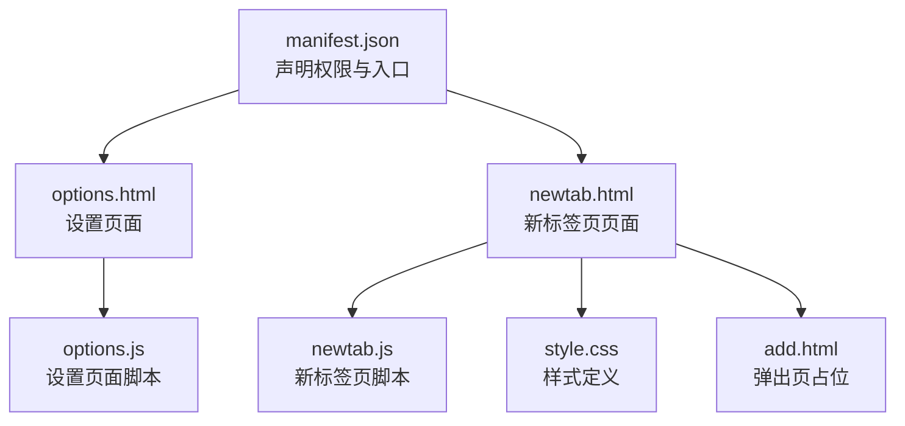
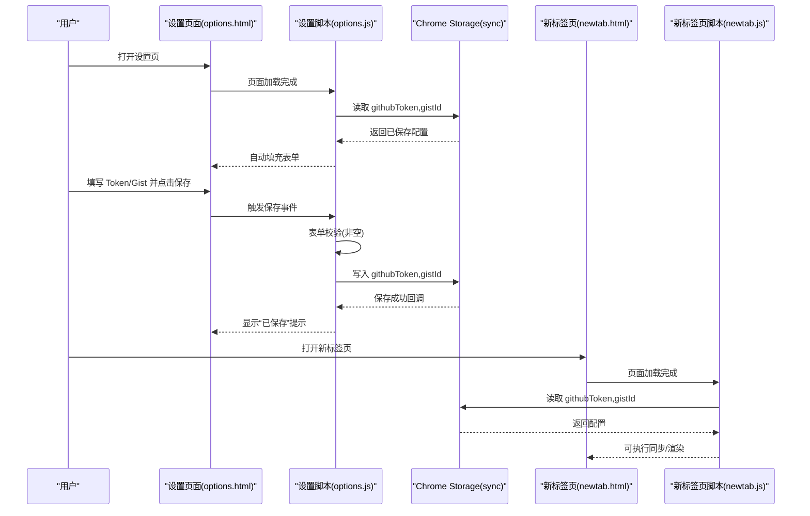
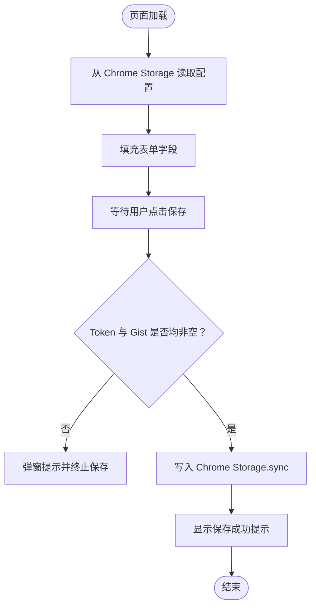
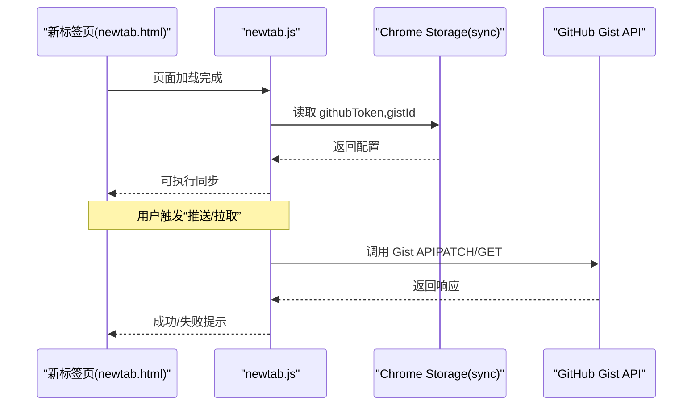
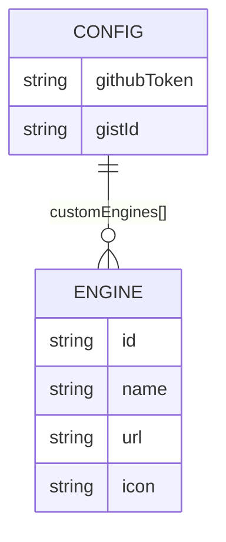
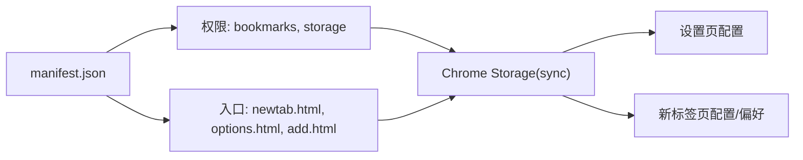

# 配置与设置

<cite>
**本文引用的文件**
- [manifest.json](file://manifest.json)
- [options.html](file://options.html)
- [options.js](file://options.js)
- [newtab.html](file://newtab.html)
- [newtab.js](file://newtab.js)
- [style.css](file://style.css)
- [add.html](file://add.html)
</cite>

## 目录
1. [简介](#简介)
2. [项目结构](#项目结构)
3. [核心组件](#核心组件)
4. [架构总览](#架构总览)
5. [详细组件分析](#详细组件分析)
6. [依赖关系分析](#依赖关系分析)
7. [性能考量](#性能考量)
8. [故障排除指南](#故障排除指南)
9. [结论](#结论)
10. [附录](#附录)

## 简介
本文件面向 MyTab 扩展的“配置与设置”系统，聚焦于设置页面的功能设计、配置项的数据结构与存储机制、GitHub Token 与 Gist ID 的配置流程、用户偏好的保存与读取、表单验证与错误处理、Chrome Storage API 的使用与数据同步策略，并提供配置迁移、备份恢复与故障排除建议。文档同时给出关键流程的可视化图示，帮助开发者与使用者快速理解与维护该系统。

## 项目结构
MyTab 扩展采用 Manifest V3 架构，核心文件包括：
- 设置页面：options.html + options.js
- 新标签页页面：newtab.html + newtab.js + style.css
- 扩展清单：manifest.json
- 其他辅助页面：add.html

图表来源
- [manifest.json](file://manifest.json#L1-L13)
- [options.html](file://options.html#L1-L77)
- [options.js](file://options.js#L1-L29)
- [newtab.html](file://newtab.html#L1-L64)
- [newtab.js](file://newtab.js#L1-L302)
- [style.css](file://style.css#L1-L199)
- [add.html](file://add.html#L1-L18)

章节来源
- [manifest.json](file://manifest.json#L1-L13)
- [options.html](file://options.html#L1-L77)
- [options.js](file://options.js#L1-L29)
- [newtab.html](file://newtab.html#L1-L64)
- [newtab.js](file://newtab.js#L1-L302)
- [style.css](file://style.css#L1-L199)
- [add.html](file://add.html#L1-L18)

## 核心组件
- 设置页面（options.html + options.js）：负责展示与编辑 GitHub Token 与 Gist ID，进行基础校验并写入 Chrome Storage。
- 新标签页页面（newtab.html + newtab.js + style.css）：负责读取配置、执行书签同步（推送/拉取）、渲染书签与搜索引擎偏好等。
- 清单文件（manifest.json）：声明权限（bookmarks、storage）、新标签页覆盖、设置页入口与弹出页。

章节来源
- [options.html](file://options.html#L61-L76)
- [options.js](file://options.js#L1-L29)
- [newtab.js](file://newtab.js#L25-L42)
- [manifest.json](file://manifest.json#L5-L12)

## 架构总览
设置与同步的整体流程如下：
- 用户在设置页填写 Token 与 Gist ID 并保存。
- 新标签页启动时从 Chrome Storage 读取配置。
- 用户可手动触发“推送/拉取”书签，通过 GitHub API 更新 Gist。

图表来源
- [options.html](file://options.html#L61-L76)
- [options.js](file://options.js#L1-L29)
- [newtab.html](file://newtab.html#L1-L64)
- [newtab.js](file://newtab.js#L25-L42)

## 详细组件分析

### 设置页面（options.html + options.js）
- 功能设计
  - 展示两个输入字段：GitHub Token（密码类型）、Gist ID（文本类型），并提供简要提示。
  - 提供“保存配置”按钮，点击后进行基础校验并写入 Chrome Storage。
  - 页面加载完成后自动从 Storage 读取已有配置并填充表单。
- 数据结构
  - 配置键名：githubToken、gistId。
  - 类型：字符串；Token 为个人访问令牌（PAT），Gist ID 为目标 Gist 的标识。
- 表单验证
  - 保存前检查两项是否均非空；若为空则弹窗提示并阻止保存。
- 数据持久化
  - 使用 chrome.storage.sync 进行读写；写入成功后显示短暂提示。
- 错误处理
  - 未显式处理网络错误；保存成功回调用于反馈。

图表来源
- [options.html](file://options.html#L61-L76)
- [options.js](file://options.js#L1-L29)

章节来源
- [options.html](file://options.html#L61-L76)
- [options.js](file://options.js#L1-L29)

### 新标签页页面（newtab.html + newtab.js + style.css）
- 配置读取与使用
  - 提供 getSettings 与 saveSettings 方法，封装对 chrome.storage.sync 的读取与写入。
  - 在执行书签推送/拉取前，先读取配置；若缺失则提示用户前往设置页配置。
- 书签同步流程
  - 推送：获取本地书签树，序列化为 JSON，调用 GitHub Gist API PATCH 更新指定文件。
  - 拉取：调用 Gist API 获取 JSON 文件内容，解析后清空并导入本地书签。
- 用户偏好（搜索引擎）
  - 通过自定义数组与索引管理当前引擎，支持添加、切换与删除。
  - 偏好保存在 Chrome Storage 中，便于跨设备同步。
- 样式与交互
  - 使用 style.css 定义毛玻璃效果、菜单布局与交互态。
  - 通过事件绑定实现菜单展开/收起、引擎切换与删除。

图表来源
- [newtab.js](file://newtab.js#L25-L42)
- [newtab.js](file://newtab.js#L43-L94)

章节来源
- [newtab.js](file://newtab.js#L25-L42)
- [newtab.js](file://newtab.js#L43-L94)
- [newtab.html](file://newtab.html#L1-L64)
- [style.css](file://style.css#L1-L199)

### 配置项数据模型
- githubToken: 字符串，用于 GitHub API 认证。
- gistId: 字符串，指向目标 Gist 的唯一标识。
- customEngines: 数组（由新标签页脚本维护），用于保存用户自定义搜索引擎列表。
- preferredEngine: 注释中出现的键名，表示用户偏好的搜索引擎标识（当前未启用）。

图表来源
- [newtab.js](file://newtab.js#L299-L301)
- [newtab.js](file://newtab.js#L223-L227)

章节来源
- [newtab.js](file://newtab.js#L299-L301)
- [newtab.js](file://newtab.js#L223-L227)

### Chrome Storage API 使用与数据同步策略
- 使用场景
  - 设置页：读取/写入 githubToken、gistId。
  - 新标签页：读取/写入 githubToken、gistId；读取/写入 customEngines。
- API 调用模式
  - 读取：chrome.storage.sync.get(keys, callback) 或返回 Promise 的封装。
  - 写入：chrome.storage.sync.set(items, callback)。
- 同步策略
  - 使用 sync（同步存储）以实现多设备间配置共享。
  - 注意：sync 存储存在配额限制与速率限制，需避免频繁写入。
- 建议
  - 对于频繁变更的用户偏好（如搜索引擎），可考虑合并写入以减少调用次数。
  - 对于大体量数据（如书签 JSON），建议仅在必要时更新，避免不必要的网络请求。

章节来源
- [options.js](file://options.js#L2-L7)
- [options.js](file://options.js#L19-L26)
- [newtab.js](file://newtab.js#L25-L42)
- [newtab.js](file://newtab.js#L299-L301)

## 依赖关系分析
- 权限与入口
  - permissions: bookmarks、storage。
  - chrome_url_overrides.newtab: newtab.html。
  - options_page: options.html。
  - action.default_popup: add.html。
- 组件耦合
  - 设置页与新标签页共享配置键名（githubToken、gistId），通过 Chrome Storage 解耦。
  - 新标签页内部模块（书签同步、搜索引擎偏好）相互独立，通过全局变量与函数协作。

图表来源
- [manifest.json](file://manifest.json#L5-L12)

章节来源
- [manifest.json](file://manifest.json#L5-L12)

## 性能考量
- 存储调用频率
  - 避免在高频事件（如输入框实时变化）中频繁写入；建议节流或在用户主动提交时写入。
- 网络请求
  - 书签同步涉及网络请求，建议在 UI 上提供加载状态与错误提示，避免阻塞主线程。
- 数据体积
  - 书签 JSON 可能较大，建议仅在必要时进行全量同步；可考虑增量更新策略（如基于时间戳或哈希）。
- UI 响应
  - 使用异步函数与 Promise，确保 UI 不被阻塞；对失败场景提供明确反馈。

## 故障排除指南
- 无法保存设置
  - 检查 Token 与 Gist 是否均非空；确认浏览器已授权存储权限。
  - 查看控制台是否有存储写入异常。
- 同步失败
  - 确认 Token 具备 gist 权限；检查 Gist ID 是否正确。
  - 查看网络面板与响应体，定位具体错误（如 404、403、401）。
- 配置未生效
  - 确认新标签页已重新加载；检查 Chrome Storage 中是否存在对应键值。
- 引擎偏好未保存
  - 确认 customEngines 写入逻辑是否执行；检查存储键名是否一致。

章节来源
- [options.js](file://options.js#L14-L17)
- [newtab.js](file://newtab.js#L43-L76)
- [newtab.js](file://newtab.js#L78-L94)

## 结论
MyTab 的配置与设置系统围绕 Chrome Storage 的同步能力构建，通过简洁的设置页与新标签页脚本实现 GitHub Token 与 Gist ID 的配置、读取与使用。系统具备基本的表单校验与错误提示，但可在以下方面进一步完善：增强错误处理与重试机制、优化存储调用频率、提供更丰富的用户反馈与配置迁移/备份方案。对于大规模书签同步，建议引入增量更新与冲突解决策略，提升稳定性与用户体验。

## 附录

### 配置迁移指南
- 导出现有配置
  - 在设置页或新标签页中读取 chrome.storage.sync 中的 githubToken、gistId、customEngines 等键值，导出为 JSON 文件。
- 导入新环境
  - 在新设备或新扩展版本中，将导出的 JSON 文件内容写回 chrome.storage.sync 对应键名。
- 注意事项
  - 确保 Token 权限与 Gist ID 有效；必要时重新生成 PAT 并更新 Gist。

### 备份与恢复方案
- 备份
  - 使用浏览器自带的扩展管理功能导出扩展数据（若可用）。
  - 手动记录 Token 与 Gist ID，作为最小化备份。
- 恢复
  - 在新环境中重新配置 Token 与 Gist ID。
  - 如需恢复搜索引擎偏好，可从备份 JSON 中读取 customEngines 并写入存储。

### 最佳实践
- 将敏感信息（Token）以只读方式显示，避免明文泄露。
- 对存储写入进行节流与去抖，降低 API 调用频率。
- 在 UI 中提供清晰的状态提示与错误信息，提升可诊断性。
- 为未来功能预留键名（如 preferredEngine），保持向后兼容。