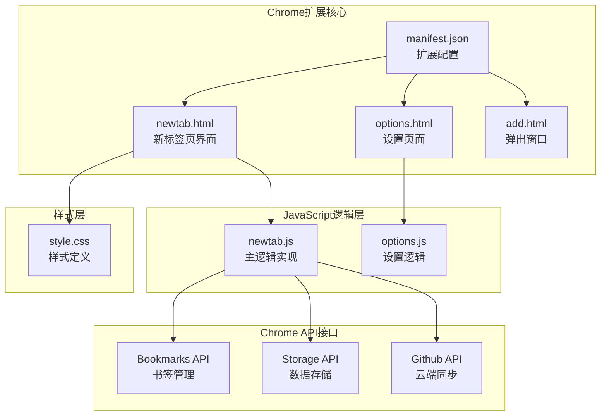
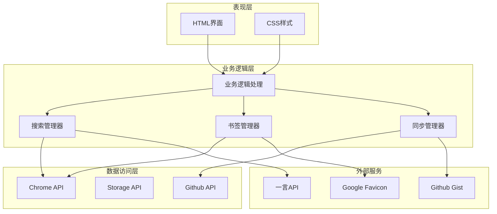
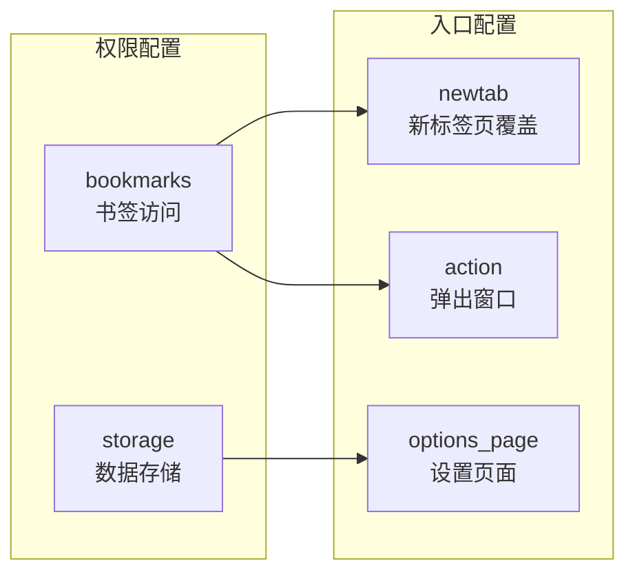
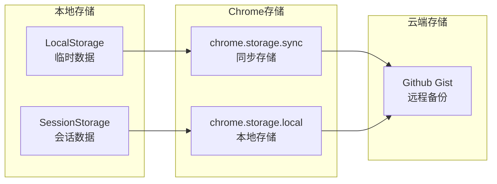
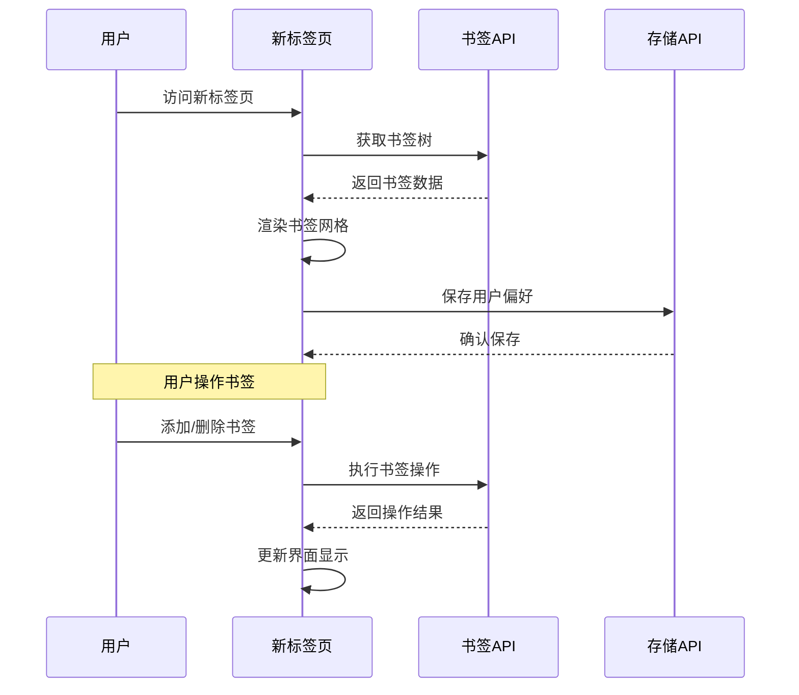
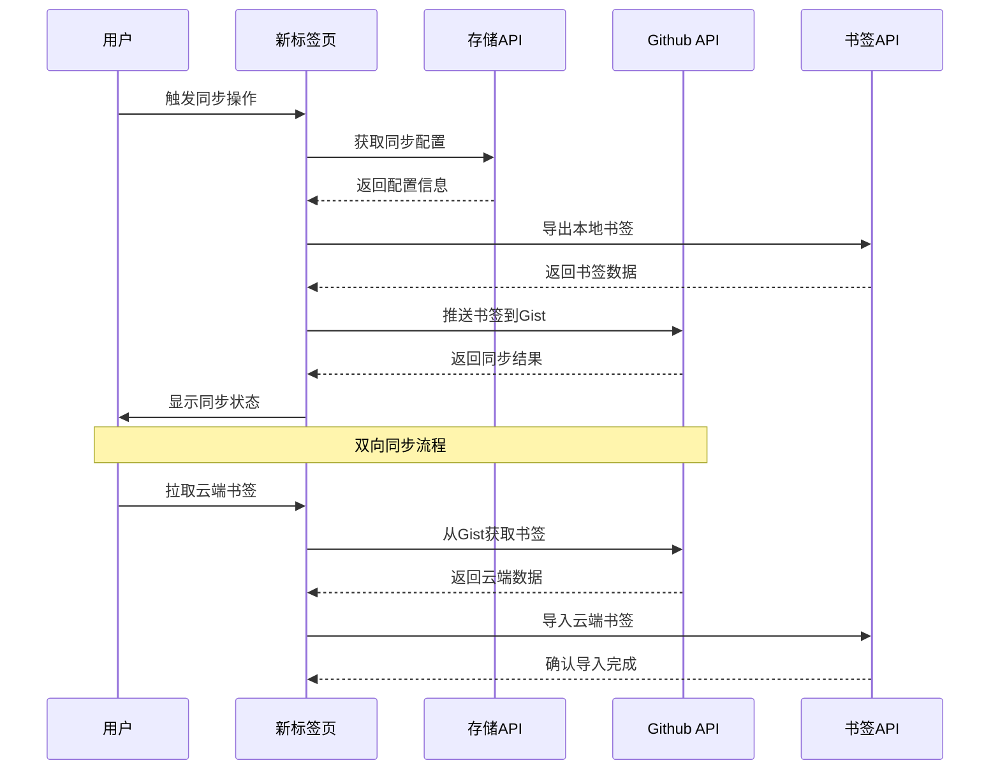

# 项目概述

<cite>
**本文档引用的文件**
- [manifest.json](file://manifest.json)
- [newtab.html](file://newtab.html)
- [newtab.js](file://newtab.js)
- [options.html](file://options.html)
- [options.js](file://options.js)
- [add.html](file://add.html)
- [style.css](file://style.css)
</cite>

## 目录
1. [项目简介](#项目简介)
2. [项目结构](#项目结构)
3. [核心功能特性](#核心功能特性)
4. [架构设计](#架构设计)
5. [技术实现分析](#技术实现分析)
6. [数据流分析](#数据流分析)
7. [性能考虑](#性能考虑)
8. [总结](#总结)

## 项目简介

MyTab是一个基于Chrome Extension Manifest V3标准开发的个性化新标签页扩展。该项目旨在为用户提供一个现代化、功能丰富的个性化浏览体验，通过集成书签管理、搜索引擎选择、GitHub同步等核心功能，帮助用户更高效地管理和访问网页内容。

### 项目特色
- **极简设计美学**：采用毛玻璃效果和现代化UI设计
- **多引擎搜索支持**：内置搜索引擎管理功能
- **云端同步能力**：通过GitHub Gist实现书签跨设备同步
- **响应式布局**：适配不同屏幕尺寸的现代浏览器界面

## 项目结构

MyTab项目采用模块化设计，主要由以下核心文件组成：

**图表来源**
- [manifest.json](file://manifest.json#L1-L13)
- [newtab.html](file://newtab.html#L1-L64)
- [options.html](file://options.html#L1-L77)

**章节来源**
- [manifest.json](file://manifest.json#L1-L13)
- [newtab.html](file://newtab.html#L1-L64)
- [options.html](file://options.html#L1-L77)
- [add.html](file://add.html#L1-L18)

## 核心功能特性

### 1. 书签管理功能
MyTab实现了完整的书签管理系统，包括：
- **书签树渲染**：递归遍历并展示所有书签节点
- **网格化显示**：采用图标+标题的网格布局
- **动态图标生成**：通过Google favicon服务获取网站图标
- **分类导航**：支持默认、工作、社交等分类标签

### 2. 智能搜索引擎
系统提供了灵活的搜索引擎管理机制：
- **多引擎支持**：内置必应、Google、百度等主流搜索引擎
- **自定义引擎**：允许用户添加新的搜索引擎
- **引擎切换**：支持点击切换当前使用的搜索引擎
- **持久化存储**：用户偏好的搜索引擎配置可保存

### 3. GitHub云端同步
创新的云端同步功能：
- **Gist集成**：通过GitHub Gist实现书签备份
- **双向同步**：支持从云端拉取和向云端推送书签
- **安全认证**：使用Personal Access Token进行身份验证
- **冲突处理**：提供同步状态反馈和错误处理

### 4. 个性化内容
增强用户体验的个性化元素：
- **每日一言**：集成一言API提供每日励志语录
- **动态背景**：支持随机背景图片和亮度调节
- **毛玻璃效果**：现代化的视觉设计风格

**章节来源**
- [newtab.js](file://newtab.js#L1-L302)
- [style.css](file://style.css#L1-L199)

## 架构设计

MyTab采用了分层架构设计，确保了良好的代码组织和可维护性：

**图表来源**
- [newtab.js](file://newtab.js#L1-L302)
- [manifest.json](file://manifest.json#L1-L13)

### 架构特点
- **模块化设计**：每个功能模块职责明确，便于维护和扩展
- **异步处理**：充分利用Promise和async/await处理异步操作
- **API抽象**：通过统一的接口封装Chrome扩展API
- **错误处理**：完善的错误捕获和用户反馈机制

## 技术实现分析

### Chrome扩展配置
项目严格遵循Manifest V3规范，配置了必要的权限和入口点：

**图表来源**
- [manifest.json](file://manifest.json#L5-L12)

### 数据存储策略
系统采用多层次的数据存储方案：

**图表来源**
- [newtab.js](file://newtab.js#L26-L42)
- [options.js](file://options.js#L1-L29)

**章节来源**
- [manifest.json](file://manifest.json#L1-L13)
- [newtab.js](file://newtab.js#L26-L42)
- [options.js](file://options.js#L1-L29)

## 数据流分析

### 书签数据流
系统实现了完整的书签数据生命周期管理：

**图表来源**
- [newtab.js](file://newtab.js#L1-L25)
- [newtab.js](file://newtab.js#L97-L106)

### 同步数据流
GitHub同步功能的数据传输流程：

**图表来源**
- [newtab.js](file://newtab.js#L43-L94)

**章节来源**
- [newtab.js](file://newtab.js#L43-L94)

## 性能考虑

### 优化策略
MyTab在性能方面采用了多项优化措施：

1. **懒加载机制**：只在需要时加载和渲染书签内容
2. **缓存策略**：利用浏览器缓存减少重复请求
3. **异步处理**：避免阻塞主线程，提升响应速度
4. **资源优化**：压缩CSS和JavaScript文件大小

### 内存管理
- **事件监听器清理**：及时移除不需要的事件监听器
- **DOM元素复用**：重用DOM元素而非频繁创建销毁
- **垃圾回收友好**：避免创建不必要的全局变量

## 总结

MyTab Chrome扩展项目展现了现代Web技术与Chrome扩展开发的最佳实践。通过精心设计的架构和丰富的功能特性，该项目为用户提供了卓越的个性化浏览体验。

### 技术亮点
- **现代化UI设计**：采用最新的CSS技术和视觉效果
- **功能完整性**：涵盖书签管理、搜索、同步等多个核心功能
- **扩展性强**：模块化设计便于功能扩展和维护
- **用户体验优秀**：简洁直观的操作界面和流畅的交互体验

### 发展方向
未来可以考虑的功能增强：
- 增强的搜索功能和智能推荐
- 更丰富的主题和个性化选项
- 多设备同步和协作功能
- 集成更多第三方服务和工具

该项目为Chrome扩展开发提供了优秀的参考范例，展示了如何在有限的API限制内实现丰富而实用的功能。